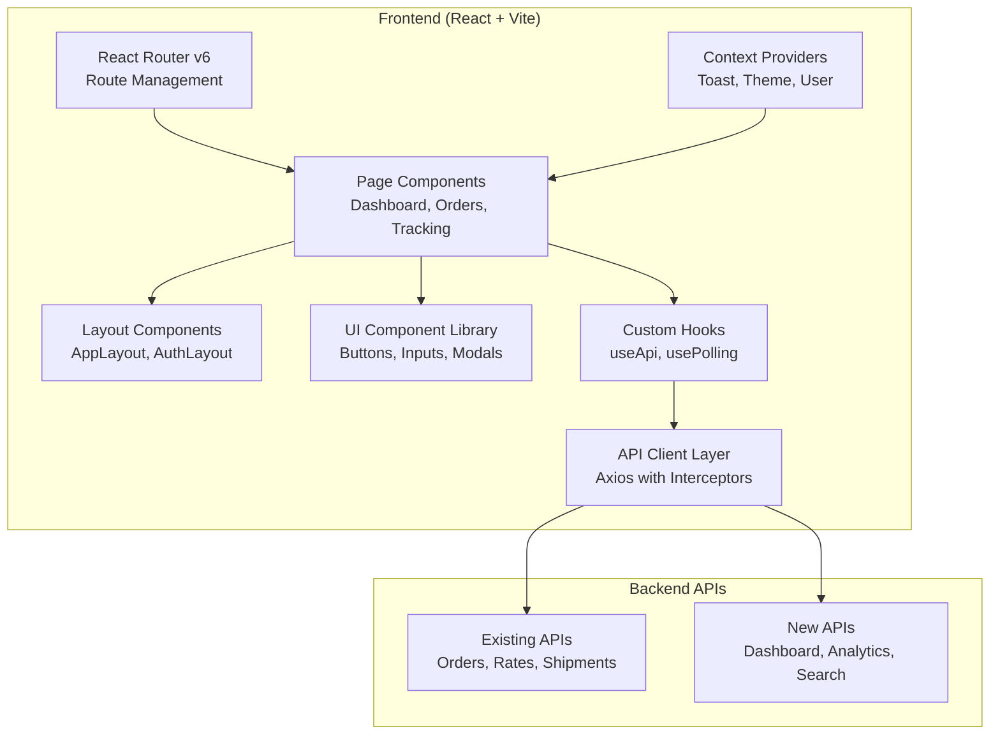

# Technical Design — Frontend Redesign & API Enhancement

## Feature Name
**frontend-redesign** - Complete UI/UX overhaul with modern React architecture and new backend APIs

## Overview
Transform the Zippy Logistics Platform from a basic single-page tab interface into a professional, production-ready application with proper routing, modern UI components, comprehensive features, and enhanced backend APIs.

---

## High-Level Design

### 1. Architecture Overview



### 2. Route Structure

```
/ (redirect to /dashboard)
├── /dashboard                  → Dashboard overview with stats
├── /orders
│   ├── /orders                → Order list with search/filter
│   ├── /orders/new            → Create new order
│   ├── /orders/:id            → Order details
│   └── /orders/:id/rates      → Rate comparison for order
├── /tracking
│   ├── /tracking              → Internal tracking center
│   └── /tracking/public/:trackingNumber → Public tracking page
├── /analytics                 → Analytics & reports
├── /webhook-studio            → Webhook simulation controls
└── /settings                  → User preferences & settings
```

### 3. Component Architecture

```
src/
├── api/
│   ├── client.js              → Axios instance with interceptors
│   ├── endpoints/
│   │   ├── orders.js          → Order-related API calls
│   │   ├── rates.js           → Rate aggregation APIs
│   │   ├── shipments.js       → Shipment management APIs
│   │   ├── tracking.js        → Tracking APIs
│   │   ├── dashboard.js       → Dashboard stats APIs
│   │   └── analytics.js       → Analytics APIs
│   └── hooks/
│       ├── useApi.js          → Generic API call hook
│       ├── usePolling.js      → Polling hook for tracking
│       └── usePagination.js   → Pagination management
├── components/
│   ├── ui/                    → Reusable UI components
│   │   ├── Button/
│   │   ├── Input/
│   │   ├── Modal/
│   │   ├── Table/
│   │   ├── Card/
│   │   ├── Badge/
│   │   ├── Toast/
│   │   ├── Skeleton/
│   │   ├── EmptyState/
│   │   └── StatusBadge/
│   ├── layouts/
│   │   ├── AppLayout.jsx      → Main app layout with sidebar
│   │   └── PublicLayout.jsx   → Public pages layout
│   ├── features/
│   │   ├── dashboard/         → Dashboard-specific components
│   │   ├── orders/            → Order management components
│   │   ├── tracking/          → Tracking components
│   │   └── analytics/         → Analytics components
│   └── common/
│       ├── Navbar.jsx
│       ├── Sidebar.jsx
│       └── ErrorBoundary.jsx
├── contexts/
│   ├── ToastContext.jsx       → Global toast notifications
│   ├── ThemeContext.jsx       → Theme preferences
│   └── UserContext.jsx        → User preferences
├── pages/
│   ├── Dashboard.jsx
│   ├── OrderList.jsx
│   ├── OrderCreate.jsx
│   ├── OrderDetails.jsx
│   ├── RateComparison.jsx
│   ├── TrackingCenter.jsx
│   ├── PublicTracking.jsx
│   ├── Analytics.jsx
│   ├── WebhookStudio.jsx
│   └── Settings.jsx
├── styles/
│   ├── global.css             → Global styles & CSS variables
│   ├── utilities.css          → Utility classes
│   └── animations.css         → Animation definitions
├── utils/
│   ├── formatters.js          → Date, currency formatting
│   ├── validators.js          → Form validation helpers
│   └── constants.js           → App constants
├── App.jsx                    → Router configuration
└── main.jsx                   → Entry point
```


### 4. Design System

#### Color Palette
```css
/* Primary Colors */
--primary-50: #f0f9ff;
--primary-500: #0ea5e9;
--primary-600: #0284c7;
--primary-700: #0369a1;

/* Neutral Colors (Dark Theme) */
--neutral-0: #000000;
--neutral-50: #0a0a0a;
--neutral-100: #171717;
--neutral-200: #262626;
--neutral-300: #404040;
--neutral-400: #525252;
--neutral-500: #737373;
--neutral-600: #a3a3a3;
--neutral-700: #d4d4d4;
--neutral-800: #e5e5e5;
--neutral-900: #f5f5f5;
--neutral-950: #ffffff;

/* Semantic Colors */
--success: #10b981;
--warning: #f59e0b;
--error: #ef4444;
--info: #3b82f6;
```

#### Typography Scale
```css
--font-heading: 'Inter', sans-serif;
--font-body: 'Inter', sans-serif;
--font-mono: 'JetBrains Mono', monospace;

--text-xs: 0.75rem;    /* 12px */
--text-sm: 0.875rem;   /* 14px */
--text-base: 1rem;     /* 16px */
--text-lg: 1.125rem;   /* 18px */
--text-xl: 1.25rem;    /* 20px */
--text-2xl: 1.5rem;    /* 24px */
--text-3xl: 1.875rem;  /* 30px */
--text-4xl: 2.25rem;   /* 36px */
```


#### Spacing System
```css
--space-1: 0.25rem;   /* 4px */
--space-2: 0.5rem;    /* 8px */
--space-3: 0.75rem;   /* 12px */
--space-4: 1rem;      /* 16px */
--space-5: 1.25rem;   /* 20px */
--space-6: 1.5rem;    /* 24px */
--space-8: 2rem;      /* 32px */
--space-10: 2.5rem;   /* 40px */
--space-12: 3rem;     /* 48px */
--space-16: 4rem;     /* 64px */
```

---

## New Backend API Endpoints

### 1. Dashboard Stats API
**GET /api/dashboard/stats**

Response:
```json
{
  "totalOrders": 156,
  "activeShipments": 23,
  "deliveredToday": 12,
  "totalRevenue": 125000.00,
  "courierBreakdown": {
    "FASTSHIP": 45,
    "QUICKEXPRESS": 67,
    "RELIABLE": 44
  },
  "statusBreakdown": {
    "ORDER_CREATED": 5,
    "CARRIER_SELECTED": 3,
    "SHIPMENT_CREATED": 8,
    "IN_TRANSIT": 15,
    "OUT_FOR_DELIVERY": 7,
    "DELIVERED": 118
  }
}
```


### 2. Order List API
**GET /api/orders?page=1&limit=20&sort=createdAt&order=desc&status=&search=**

Query Parameters:
- `page`: Page number (default: 1)
- `limit`: Items per page (default: 20)
- `sort`: Sort field (createdAt, orderStatus, totalAmount)
- `order`: Sort order (asc, desc)
- `status`: Filter by order status
- `search`: Search by orderId, merchantOrderId, customerName

Response:
```json
{
  "data": [
    {
      "orderId": "ZPY-ORD-10001",
      "merchantOrderId": "MERCHANT-10001",
      "customerName": "Rahul Sharma",
      "orderStatus": "DELIVERED",
      "totalAmount": 182.90,
      "createdAt": "2026-07-15T09:00:00Z",
      "deliveryPincode": "110001",
      "carrierCode": "FASTSHIP"
    }
  ],
  "pagination": {
    "currentPage": 1,
    "totalPages": 8,
    "totalItems": 156,
    "limit": 20
  }
}
```

### 3. Order Search API
**GET /api/orders/search?q={query}**

Searches across: orderId, merchantOrderId, tracking number, customer name, phone

Response: Same as order list


### 4. Recent Orders API
**GET /api/dashboard/recent-orders?limit=10**

Response:
```json
{
  "orders": [
    {
      "orderId": "ZPY-ORD-10156",
      "merchantOrderId": "MERCHANT-10156",
      "customerName": "Priya Verma",
      "orderStatus": "IN_TRANSIT",
      "createdAt": "2026-07-24T14:30:00Z",
      "deliveryCity": "Mumbai"
    }
  ]
}
```

### 5. Analytics - Courier Performance API
**GET /api/analytics/courier-performance?period=30d**

Response:
```json
{
  "couriers": [
    {
      "carrierCode": "FASTSHIP",
      "carrierName": "FastShip",
      "totalShipments": 45,
      "deliveredOnTime": 42,
      "averageDeliveryDays": 2.1,
      "successRate": 93.3,
      "averageCost": 175.50
    },
    {
      "carrierCode": "QUICKEXPRESS",
      "carrierName": "QuickExpress",
      "totalShipments": 67,
      "deliveredOnTime": 61,
      "averageDeliveryDays": 2.5,
      "successRate": 91.0,
      "averageCost": 185.20
    }
  ]
}
```


### 6. Order Trends API
**GET /api/analytics/order-trends?period=7d**

Response:
```json
{
  "trends": [
    {
      "date": "2026-07-18",
      "orderCount": 12,
      "deliveredCount": 8,
      "totalRevenue": 2150.00
    },
    {
      "date": "2026-07-19",
      "orderCount": 15,
      "deliveredCount": 10,
      "totalRevenue": 2675.50
    }
  ]
}
```

### 7. Active Shipments API
**GET /api/shipments/active**

Returns all shipments not in terminal state (DELIVERED, RTO, DELIVERY_FAILED)

Response:
```json
{
  "shipments": [
    {
      "orderId": "ZPY-ORD-10145",
      "trackingNumber": "FST123456789",
      "carrierCode": "FASTSHIP",
      "currentStatus": "IN_TRANSIT",
      "customerName": "Rahul Sharma",
      "deliveryCity": "New Delhi",
      "estimatedDelivery": "2026-07-25",
      "updatedAt": "2026-07-24T10:30:00Z"
    }
  ]
}
```


### 8. Public Tracking API
**GET /api/tracking/public/{trackingNumber}**

No authentication required. For customer-facing tracking pages.

Response:
```json
{
  "trackingNumber": "FST123456789",
  "carrierName": "FastShip",
  "currentStatus": "OUT_FOR_DELIVERY",
  "estimatedDelivery": "2026-07-24",
  "events": [
    {
      "status": "SHIPMENT_CREATED",
      "description": "Shipment booked",
      "eventTime": "2026-07-22T09:00:00Z"
    },
    {
      "status": "PICKED_UP",
      "description": "Package picked up",
      "location": "Bengaluru Hub",
      "eventTime": "2026-07-22T14:00:00Z"
    }
  ],
  "delivery": {
    "city": "New Delhi",
    "pincode": "110001"
  }
}
```

### 9. Order Export API
**POST /api/orders/bulk-export**

Request:
```json
{
  "format": "csv",
  "filters": {
    "status": "DELIVERED",
    "startDate": "2026-07-01",
    "endDate": "2026-07-31"
  }
}
```

Response: Returns CSV/JSON file download


### 10. Order Cancel API
**PATCH /api/orders/{orderId}/cancel**

Can only cancel orders before shipment creation.

Response:
```json
{
  "orderId": "ZPY-ORD-10001",
  "orderStatus": "CANCELLED",
  "cancelledAt": "2026-07-24T15:30:00Z"
}
```

### 11. Health Check API
**GET /api/health**

Response:
```json
{
  "status": "healthy",
  "timestamp": "2026-07-24T15:30:00Z",
  "services": {
    "database": "up",
    "fastship": "up",
    "quickexpress": "down",
    "reliable": "up"
  }
}
```

---

## Low-Level Design

### 1. API Client Implementation

**api/client.js**
```javascript
import axios from 'axios';

const apiClient = axios.create({
  baseURL: import.meta.env.VITE_API_BASE_URL || 'http://localhost:8080',
  timeout: 10000,
  headers: {
    'Content-Type': 'application/json'
  }
});

// Request interceptor
apiClient.interceptors.request.use(
  (config) => {
    // Add loading state
    return config;
  },
  (error) => Promise.reject(error)
);


// Response interceptor
apiClient.interceptors.response.use(
  (response) => response,
  (error) => {
    // Handle errors globally
    const message = error.response?.data?.message || 'An error occurred';
    // Toast notification will be triggered
    return Promise.reject({ message, status: error.response?.status });
  }
);

export default apiClient;
```

**api/endpoints/orders.js**
```javascript
import apiClient from '../client';

export const ordersApi = {
  getAll: (params) => apiClient.get('/api/orders', { params }),
  getById: (id) => apiClient.get(`/api/orders/${id}`),
  create: (data) => apiClient.post('/api/orders', data),
  search: (query) => apiClient.get('/api/orders/search', { params: { q: query } }),
  cancel: (id) => apiClient.patch(`/api/orders/${id}/cancel`),
  export: (filters) => apiClient.post('/api/orders/bulk-export', filters, {
    responseType: 'blob'
  })
};
```

### 2. Custom Hooks

**api/hooks/useApi.js**
```javascript
import { useState, useCallback } from 'react';
import { useToast } from '../../contexts/ToastContext';

export function useApi(apiFunc) {
  const [data, setData] = useState(null);
  const [loading, setLoading] = useState(false);
  const [error, setError] = useState(null);
  const { showToast } = useToast();

  const execute = useCallback(async (...args) => {
    setLoading(true);
    setError(null);
    try {
      const response = await apiFunc(...args);
      setData(response.data);
      return response.data;
    } catch (err) {
      setError(err.message);
      showToast(err.message, 'error');
      throw err;
    } finally {
      setLoading(false);
    }
  }, [apiFunc, showToast]);

  return { data, loading, error, execute };
}
```


**api/hooks/usePolling.js**
```javascript
import { useEffect, useRef } from 'react';

export function usePolling(callback, interval = 5000, enabled = true) {
  const savedCallback = useRef(callback);
  
  useEffect(() => {
    savedCallback.current = callback;
  }, [callback]);

  useEffect(() => {
    if (!enabled) return;
    
    const tick = () => savedCallback.current();
    const id = setInterval(tick, interval);
    return () => clearInterval(id);
  }, [interval, enabled]);
}
```

### 3. Context Providers

**contexts/ToastContext.jsx**
```javascript
import React, { createContext, useContext, useState, useCallback } from 'react';

const ToastContext = createContext(null);

export function ToastProvider({ children }) {
  const [toasts, setToasts] = useState([]);

  const showToast = useCallback((message, type = 'info', duration = 5000) => {
    const id = Date.now();
    setToasts(prev => [...prev, { id, message, type }]);
    
    if (duration > 0) {
      setTimeout(() => {
        setToasts(prev => prev.filter(t => t.id !== id));
      }, duration);
    }
  }, []);

  const removeToast = useCallback((id) => {
    setToasts(prev => prev.filter(t => t.id !== id));
  }, []);

  return (
    <ToastContext.Provider value={{ toasts, showToast, removeToast }}>
      {children}
    </ToastContext.Provider>
  );
}

export const useToast = () => useContext(ToastContext);
```


### 4. UI Component Specifications

**components/ui/Button/Button.jsx**
```javascript
export function Button({ 
  variant = 'primary',    // primary, secondary, outline, ghost, danger
  size = 'md',            // sm, md, lg
  loading = false,
  disabled = false,
  icon,
  children,
  ...props 
}) {
  const baseClasses = 'btn';
  const variantClasses = {
    primary: 'btn-primary',
    secondary: 'btn-secondary',
    outline: 'btn-outline',
    ghost: 'btn-ghost',
    danger: 'btn-danger'
  };
  const sizeClasses = {
    sm: 'btn-sm',
    md: 'btn-md',
    lg: 'btn-lg'
  };

  return (
    <button
      className={`${baseClasses} ${variantClasses[variant]} ${sizeClasses[size]}`}
      disabled={disabled || loading}
      {...props}
    >
      {loading && <LoadingSpinner size="sm" />}
      {icon && <span className="btn-icon">{icon}</span>}
      {children}
    </button>
  );
}
```

**CSS for Button:**
```css
.btn {
  display: inline-flex;
  align-items: center;
  justify-content: center;
  gap: var(--space-2);
  font-weight: 600;
  border-radius: var(--radius-md);
  transition: all 0.15s ease;
  cursor: pointer;
  border: 1px solid transparent;
}

.btn-primary {
  background: var(--primary-600);
  color: white;
}

.btn-primary:hover { background: var(--primary-700); }
.btn-secondary { background: var(--neutral-100); color: var(--neutral-950); }
.btn-outline { background: transparent; border-color: var(--neutral-300); }
.btn-sm { padding: var(--space-2) var(--space-3); font-size: var(--text-sm); }
.btn-md { padding: var(--space-3) var(--space-4); font-size: var(--text-base); }
.btn-lg { padding: var(--space-4) var(--space-6); font-size: var(--text-lg); }
```


**components/ui/Table/Table.jsx**
```javascript
export function Table({ 
  columns,           // [{ key, label, sortable, render }]
  data,
  onSort,
  sortKey,
  sortOrder,
  loading = false,
  emptyMessage = 'No data available'
}) {
  return (
    <div className="table-container">
      {loading ? (
        <TableSkeleton rows={5} />
      ) : data.length === 0 ? (
        <EmptyState message={emptyMessage} />
      ) : (
        <table className="table">
          <thead>
            <tr>
              {columns.map(col => (
                <th key={col.key}>
                  {col.sortable ? (
                    <button 
                      className="table-sort-btn"
                      onClick={() => onSort(col.key)}
                    >
                      {col.label}
                      {sortKey === col.key && (
                        <SortIcon direction={sortOrder} />
                      )}
                    </button>
                  ) : (
                    col.label
                  )}
                </th>
              ))}
            </tr>
          </thead>
          <tbody>
            {data.map((row, idx) => (
              <tr key={idx}>
                {columns.map(col => (
                  <td key={col.key}>
                    {col.render ? col.render(row) : row[col.key]}
                  </td>
                ))}
              </tr>
            ))}
          </tbody>
        </table>
      )}
    </div>
  );
}
```


**components/ui/Modal/Modal.jsx**
```javascript
export function Modal({ isOpen, onClose, title, children, footer }) {
  if (!isOpen) return null;

  return (
    <div className="modal-overlay" onClick={onClose}>
      <div className="modal-content" onClick={(e) => e.stopPropagation()}>
        <div className="modal-header">
          <h3 className="modal-title">{title}</h3>
          <button className="modal-close" onClick={onClose}>✕</button>
        </div>
        <div className="modal-body">{children}</div>
        {footer && <div className="modal-footer">{footer}</div>}
      </div>
    </div>
  );
}
```

**components/ui/StatusBadge/StatusBadge.jsx**
```javascript
export function StatusBadge({ status }) {
  const statusConfig = {
    ORDER_CREATED: { label: 'Created', color: 'blue' },
    CARRIER_SELECTED: { label: 'Carrier Selected', color: 'purple' },
    SHIPMENT_CREATED: { label: 'Booked', color: 'cyan' },
    PICKED_UP: { label: 'Picked Up', color: 'yellow' },
    IN_TRANSIT: { label: 'In Transit', color: 'orange' },
    OUT_FOR_DELIVERY: { label: 'Out for Delivery', color: 'amber' },
    DELIVERED: { label: 'Delivered', color: 'green' },
    DELIVERY_FAILED: { label: 'Failed', color: 'red' },
    RTO: { label: 'RTO', color: 'gray' },
    CANCELLED: { label: 'Cancelled', color: 'gray' }
  };

  const config = statusConfig[status] || { label: status, color: 'gray' };

  return (
    <span className={`badge badge-${config.color}`}>
      {config.label}
    </span>
  );
}
```


### 5. Page Component Specifications

**pages/Dashboard.jsx**
```javascript
import { useEffect, useState } from 'react';
import { dashboardApi } from '../api/endpoints/dashboard';
import { useApi } from '../api/hooks/useApi';
import StatsCard from '../components/features/dashboard/StatsCard';
import RecentOrdersTable from '../components/features/dashboard/RecentOrdersTable';
import CourierChart from '../components/features/dashboard/CourierChart';

export default function Dashboard() {
  const { data: stats, loading: statsLoading, execute: fetchStats } = useApi(dashboardApi.getStats);
  const { data: recentOrders, execute: fetchRecent } = useApi(dashboardApi.getRecentOrders);

  useEffect(() => {
    fetchStats();
    fetchRecent();
  }, []);

  return (
    <div className="page-container">
      <div className="page-header">
        <h1>Dashboard</h1>
        <Button onClick={() => navigate('/orders/new')}>
          Create New Order
        </Button>
      </div>

      {/* Stats Cards Grid */}
      <div className="stats-grid">
        <StatsCard
          title="Total Orders"
          value={stats?.totalOrders || 0}
          icon="📦"
          trend="+12%"
          loading={statsLoading}
        />
        <StatsCard
          title="Active Shipments"
          value={stats?.activeShipments || 0}
          icon="🚚"
          loading={statsLoading}
        />
        <StatsCard
          title="Delivered Today"
          value={stats?.deliveredToday || 0}
          icon="✅"
          loading={statsLoading}
        />
        <StatsCard
          title="Total Revenue"
          value={`₹${stats?.totalRevenue?.toLocaleString() || 0}`}
          icon="💰"
          loading={statsLoading}
        />
      </div>

      {/* Charts & Recent Orders */}
      <div className="dashboard-grid">
        <Card title="Courier Distribution">
          <CourierChart data={stats?.courierBreakdown} />
        </Card>
        <Card title="Recent Orders">
          <RecentOrdersTable data={recentOrders} />
        </Card>
      </div>
    </div>
  );
}
```


**pages/OrderList.jsx**
```javascript
import { useState, useEffect } from 'react';
import { useNavigate } from 'react-router-dom';
import { ordersApi } from '../api/endpoints/orders';
import { useApi } from '../api/hooks/useApi';
import Table from '../components/ui/Table';
import Pagination from '../components/ui/Pagination';
import SearchInput from '../components/ui/Input/SearchInput';
import StatusBadge from '../components/ui/StatusBadge';

export default function OrderList() {
  const navigate = useNavigate();
  const [page, setPage] = useState(1);
  const [sortKey, setSortKey] = useState('createdAt');
  const [sortOrder, setSortOrder] = useState('desc');
  const [searchQuery, setSearchQuery] = useState('');
  const [statusFilter, setStatusFilter] = useState('');

  const { data, loading, execute } = useApi(ordersApi.getAll);

  useEffect(() => {
    execute({ page, sort: sortKey, order: sortOrder, search: searchQuery, status: statusFilter });
  }, [page, sortKey, sortOrder, searchQuery, statusFilter]);

  const columns = [
    { key: 'orderId', label: 'Order ID', sortable: true },
    { key: 'merchantOrderId', label: 'Merchant ID', sortable: true },
    { key: 'customerName', label: 'Customer', sortable: true },
    { 
      key: 'orderStatus', 
      label: 'Status', 
      sortable: true,
      render: (row) => <StatusBadge status={row.orderStatus} />
    },
    { 
      key: 'totalAmount', 
      label: 'Amount', 
      sortable: true,
      render: (row) => `₹${row.totalAmount.toFixed(2)}`
    },
    { 
      key: 'createdAt', 
      label: 'Created', 
      sortable: true,
      render: (row) => new Date(row.createdAt).toLocaleDateString()
    },
    {
      key: 'actions',
      label: 'Actions',
      render: (row) => (
        <Button size="sm" onClick={() => navigate(`/orders/${row.orderId}`)}>
          View
        </Button>
      )
    }
  ];

  return (
    <div className="page-container">
      <div className="page-header">
        <h1>Orders</h1>
        <Button onClick={() => navigate('/orders/new')}>Create Order</Button>
      </div>

      {/* Filters */}
      <div className="filters-bar">
        <SearchInput 
          value={searchQuery}
          onChange={setSearchQuery}
          placeholder="Search orders..."
        />
        <Select
          value={statusFilter}
          onChange={setStatusFilter}
          options={[
            { value: '', label: 'All Status' },
            { value: 'ORDER_CREATED', label: 'Created' },
            { value: 'DELIVERED', label: 'Delivered' }
          ]}
        />
      </div>

      <Card>
        <Table
          columns={columns}
          data={data?.data || []}
          loading={loading}
          sortKey={sortKey}
          sortOrder={sortOrder}
          onSort={(key) => {
            if (sortKey === key) {
              setSortOrder(sortOrder === 'asc' ? 'desc' : 'asc');
            } else {
              setSortKey(key);
              setSortOrder('desc');
            }
          }}
        />
        <Pagination
          currentPage={page}
          totalPages={data?.pagination?.totalPages || 1}
          onPageChange={setPage}
        />
      </Card>
    </div>
  );
}
```


### 6. Layout Components

**components/layouts/AppLayout.jsx**
```javascript
import { Outlet } from 'react-router-dom';
import Sidebar from '../common/Sidebar';
import Navbar from '../common/Navbar';
import ToastContainer from '../ui/Toast/ToastContainer';

export default function AppLayout() {
  return (
    <div className="app-layout">
      <Sidebar />
      <div className="app-main">
        <Navbar />
        <main className="app-content">
          <Outlet />
        </main>
      </div>
      <ToastContainer />
    </div>
  );
}
```

**components/common/Sidebar.jsx**
```javascript
import { NavLink } from 'react-router-dom';

const navItems = [
  { path: '/dashboard', icon: '📊', label: 'Dashboard' },
  { path: '/orders', icon: '📦', label: 'Orders' },
  { path: '/tracking', icon: '🔍', label: 'Tracking' },
  { path: '/analytics', icon: '📈', label: 'Analytics' },
  { path: '/webhook-studio', icon: '⚙️', label: 'Webhooks' },
  { path: '/settings', icon: '⚙️', label: 'Settings' }
];

export default function Sidebar() {
  return (
    <aside className="sidebar">
      <div className="sidebar-brand">
        <div className="brand-icon">Z</div>
        <span className="brand-name">Zippy</span>
      </div>
      <nav className="sidebar-nav">
        {navItems.map(item => (
          <NavLink
            key={item.path}
            to={item.path}
            className={({ isActive }) => 
              `sidebar-link ${isActive ? 'active' : ''}`
            }
          >
            <span className="link-icon">{item.icon}</span>
            <span className="link-label">{item.label}</span>
          </NavLink>
        ))}
      </nav>
    </aside>
  );
}
```


### 7. Responsive Design Breakpoints

```css
/* Mobile First Approach */
:root {
  --breakpoint-sm: 640px;
  --breakpoint-md: 768px;
  --breakpoint-lg: 1024px;
  --breakpoint-xl: 1280px;
}

/* Mobile (default) */
.app-layout {
  display: flex;
  flex-direction: column;
}

.sidebar {
  display: none; /* Hidden on mobile, hamburger menu instead */
}

/* Tablet */
@media (min-width: 768px) {
  .app-layout {
    flex-direction: row;
  }
  
  .sidebar {
    display: flex;
    width: 240px;
  }
  
  .stats-grid {
    grid-template-columns: repeat(2, 1fr);
  }
}

/* Desktop */
@media (min-width: 1024px) {
  .stats-grid {
    grid-template-columns: repeat(4, 1fr);
  }
  
  .dashboard-grid {
    grid-template-columns: 1fr 1fr;
  }
}
```

### 8. Animation Specifications

**styles/animations.css**
```css
/* Fade In */
@keyframes fadeIn {
  from { opacity: 0; }
  to { opacity: 1; }
}

/* Slide In */
@keyframes slideInRight {
  from { transform: translateX(20px); opacity: 0; }
  to { transform: translateX(0); opacity: 1; }
}

/* Scale In */
@keyframes scaleIn {
  from { transform: scale(0.95); opacity: 0; }
  to { transform: scale(1); opacity: 1; }
}

/* Utility Classes */
.animate-fade-in {
  animation: fadeIn 0.2s ease-out;
}

.animate-slide-in {
  animation: slideInRight 0.3s ease-out;
}

.animate-scale-in {
  animation: scaleIn 0.2s ease-out;
}

/* Hover Effects */
.hover-lift {
  transition: transform 0.2s ease, box-shadow 0.2s ease;
}

.hover-lift:hover {
  transform: translateY(-2px);
  box-shadow: 0 8px 24px rgba(0, 0, 0, 0.12);
}
```


### 9. Utility Functions

**utils/formatters.js**
```javascript
export function formatCurrency(amount) {
  return new Intl.NumberFormat('en-IN', {
    style: 'currency',
    currency: 'INR'
  }).format(amount);
}

export function formatDate(dateString, format = 'short') {
  const date = new Date(dateString);
  
  if (format === 'short') {
    return date.toLocaleDateString('en-IN');
  }
  
  if (format === 'long') {
    return date.toLocaleDateString('en-IN', {
      year: 'numeric',
      month: 'long',
      day: 'numeric',
      hour: '2-digit',
      minute: '2-digit'
    });
  }
  
  return date.toISOString();
}

export function formatRelativeTime(dateString) {
  const date = new Date(dateString);
  const now = new Date();
  const diffMs = now - date;
  const diffMins = Math.floor(diffMs / 60000);
  const diffHours = Math.floor(diffMs / 3600000);
  const diffDays = Math.floor(diffMs / 86400000);

  if (diffMins < 1) return 'Just now';
  if (diffMins < 60) return `${diffMins}m ago`;
  if (diffHours < 24) return `${diffHours}h ago`;
  if (diffDays < 7) return `${diffDays}d ago`;
  
  return formatDate(dateString);
}
```

**utils/validators.js**
```javascript
export function validatePhone(phone) {
  const phoneRegex = /^[6-9]\d{9}$/;
  return phoneRegex.test(phone);
}

export function validatePincode(pincode) {
  const pincodeRegex = /^\d{6}$/;
  return pincodeRegex.test(pincode);
}

export function validateEmail(email) {
  const emailRegex = /^[^\s@]+@[^\s@]+\.[^\s@]+$/;
  return emailRegex.test(email);
}
```


### 10. Router Configuration

**App.jsx**
```javascript
import { BrowserRouter, Routes, Route, Navigate } from 'react-router-dom';
import { ToastProvider } from './contexts/ToastContext';
import { ThemeProvider } from './contexts/ThemeContext';
import AppLayout from './components/layouts/AppLayout';
import PublicLayout from './components/layouts/PublicLayout';
import Dashboard from './pages/Dashboard';
import OrderList from './pages/OrderList';
import OrderCreate from './pages/OrderCreate';
import OrderDetails from './pages/OrderDetails';
import RateComparison from './pages/RateComparison';
import TrackingCenter from './pages/TrackingCenter';
import PublicTracking from './pages/PublicTracking';
import Analytics from './pages/Analytics';
import WebhookStudio from './pages/WebhookStudio';
import Settings from './pages/Settings';
import NotFound from './pages/NotFound';
import ErrorBoundary from './components/common/ErrorBoundary';

export default function App() {
  return (
    <ErrorBoundary>
      <ThemeProvider>
        <ToastProvider>
          <BrowserRouter>
            <Routes>
              {/* Main App Routes with Sidebar */}
              <Route element={<AppLayout />}>
                <Route path="/" element={<Navigate to="/dashboard" replace />} />
                <Route path="/dashboard" element={<Dashboard />} />
                <Route path="/orders" element={<OrderList />} />
                <Route path="/orders/new" element={<OrderCreate />} />
                <Route path="/orders/:id" element={<OrderDetails />} />
                <Route path="/orders/:id/rates" element={<RateComparison />} />
                <Route path="/tracking" element={<TrackingCenter />} />
                <Route path="/analytics" element={<Analytics />} />
                <Route path="/webhook-studio" element={<WebhookStudio />} />
                <Route path="/settings" element={<Settings />} />
              </Route>

              {/* Public Routes without Sidebar */}
              <Route element={<PublicLayout />}>
                <Route path="/tracking/public/:trackingNumber" element={<PublicTracking />} />
              </Route>

              {/* 404 Not Found */}
              <Route path="*" element={<NotFound />} />
            </Routes>
          </BrowserRouter>
        </ToastProvider>
      </ThemeProvider>
    </ErrorBoundary>
  );
}
```


---

## Implementation Strategy

### Phase 1: Foundation (Priority: High)
1. Set up new folder structure
2. Create API client layer with interceptors
3. Implement Context providers (Toast, Theme)
4. Set up React Router with basic routes
5. Create base layout components (AppLayout, Sidebar, Navbar)
6. Implement core UI components (Button, Input, Card, Table, Modal)

### Phase 2: Core Pages (Priority: High)
1. Dashboard page with stats cards
2. Order list page with search/filter/pagination
3. Order create page (migrate existing form)
4. Order details page with tracking
5. Rate comparison page (enhanced version)

### Phase 3: Backend APIs (Priority: High)
1. Implement Dashboard Stats API
2. Implement Order List API with pagination
3. Implement Order Search API
4. Implement Recent Orders API
5. Add Health Check API

### Phase 4: Advanced Features (Priority: Medium)
1. Analytics page with charts
2. Courier performance metrics API
3. Order trends API
4. Active shipments API
5. Public tracking page
6. Webhook studio enhancements

### Phase 5: Polish & Optimization (Priority: Medium)
1. Add loading skeletons
2. Implement animations
3. Add responsive design
4. Error boundary implementation
5. Accessibility improvements
6. Performance optimization (code splitting)

### Phase 6: Additional Features (Priority: Low)
1. Order export functionality
2. Order cancel API
3. Bulk operations
4. User preferences/settings
5. Theme customization


---

## Backend Implementation Notes

### New Controllers Needed

**DashboardController.java**
```java
@RestController
@RequestMapping("/api/dashboard")
public class DashboardController {
    
    @GetMapping("/stats")
    public ResponseEntity<DashboardStatsResponse> getStats() {
        // Aggregate stats from Order and Shipment repositories
    }
    
    @GetMapping("/recent-orders")
    public ResponseEntity<List<OrderSummaryDto>> getRecentOrders(
        @RequestParam(defaultValue = "10") int limit
    ) {
        // Return latest orders ordered by createdAt desc
    }
}
```

**AnalyticsController.java**
```java
@RestController
@RequestMapping("/api/analytics")
public class AnalyticsController {
    
    @GetMapping("/courier-performance")
    public ResponseEntity<CourierPerformanceResponse> getCourierPerformance(
        @RequestParam(defaultValue = "30d") String period
    ) {
        // Calculate success rates, avg delivery times per courier
    }
    
    @GetMapping("/order-trends")
    public ResponseEntity<OrderTrendsResponse> getOrderTrends(
        @RequestParam(defaultValue = "7d") String period
    ) {
        // Return daily order counts and revenue
    }
}
```

**Enhanced OrderController**
```java
@GetMapping
public ResponseEntity<PaginatedOrderResponse> getAllOrders(
    @RequestParam(defaultValue = "1") int page,
    @RequestParam(defaultValue = "20") int limit,
    @RequestParam(defaultValue = "createdAt") String sort,
    @RequestParam(defaultValue = "desc") String order,
    @RequestParam(required = false) String status,
    @RequestParam(required = false) String search
) {
    // Return paginated, sorted, filtered orders
}

@GetMapping("/search")
public ResponseEntity<List<OrderDto>> searchOrders(@RequestParam String q) {
    // Search across orderId, merchantOrderId, customer name, phone, tracking
}

@PatchMapping("/{orderId}/cancel")
public ResponseEntity<OrderResponse> cancelOrder(@PathVariable String orderId) {
    // Cancel order if status is ORDER_CREATED or CARRIER_SELECTED
}
```


**ShipmentController enhancements**
```java
@GetMapping("/active")
public ResponseEntity<List<ShipmentDto>> getActiveShipments() {
    // Return all shipments not in terminal states
    // (not DELIVERED, RTO, DELIVERY_FAILED, CANCELLED)
}
```

**TrackingController (new)**
```java
@RestController
@RequestMapping("/api/tracking")
public class TrackingController {
    
    @GetMapping("/public/{trackingNumber}")
    public ResponseEntity<PublicTrackingResponse> getPublicTracking(
        @PathVariable String trackingNumber
    ) {
        // Public endpoint - no auth required
        // Return sanitized tracking info (no customer details except city)
    }
}
```

**HealthController (new)**
```java
@RestController
@RequestMapping("/api/health")
public class HealthController {
    
    private final List<CourierClient> courierClients;
    
    @GetMapping
    public ResponseEntity<HealthResponse> getHealth() {
        Map<String, String> services = new HashMap<>();
        services.put("database", checkDatabase());
        
        for (CourierClient client : courierClients) {
            services.put(client.getCarrierCode().toLowerCase(), 
                        checkCourierHealth(client));
        }
        
        return ResponseEntity.ok(new HealthResponse("healthy", services));
    }
}
```

### Database Query Optimizations

**OrderRepository.java**
```java
@Query("SELECT o FROM Order o WHERE " +
       "LOWER(o.zippyOrderId) LIKE LOWER(CONCAT('%', :query, '%')) OR " +
       "LOWER(o.merchantOrderId) LIKE LOWER(CONCAT('%', :query, '%')) OR " +
       "LOWER(o.customerName) LIKE LOWER(CONCAT('%', :query, '%')) OR " +
       "o.customerPhone LIKE CONCAT('%', :query, '%')")
Page<Order> searchOrders(@Param("query") String query, Pageable pageable);

@Query("SELECT COUNT(o) FROM Order o WHERE o.orderStatus = :status")
long countByStatus(@Param("status") String status);

@Query("SELECT o FROM Order o ORDER BY o.createdAt DESC LIMIT :limit")
List<Order> findRecentOrders(@Param("limit") int limit);
```


---

## Testing Strategy

### Frontend Testing

**Unit Tests (Vitest + React Testing Library)**
- Test all UI components in isolation
- Test utility functions (formatters, validators)
- Test custom hooks (useApi, usePolling)
- Test context providers

**Integration Tests**
- Test page components with mock API responses
- Test routing and navigation
- Test form submissions
- Test error handling flows

**E2E Tests (Playwright - Optional)**
- Test complete user flows
- Test order creation → rates → selection → tracking
- Test search and filtering
- Test responsive design

### Backend Testing

**Controller Tests**
- Test all new API endpoints
- Test pagination, sorting, filtering
- Test error responses
- Test validation

**Service Layer Tests**
- Test dashboard stats calculation
- Test courier performance metrics
- Test search functionality
- Test order cancellation logic

**Repository Tests**
- Test custom queries
- Test pagination
- Test search queries

---

## Migration Path

### Step 1: Parallel Development
- Keep existing App.jsx functional
- Build new structure in parallel
- Test new components independently

### Step 2: Gradual Migration
- Move one page at a time to new structure
- Start with Dashboard (new page)
- Migrate Order create form
- Migrate Rate comparison
- Migrate Tracking

### Step 3: Cleanup
- Remove old components
- Remove old CSS
- Update documentation

### Step 4: Backend API Rollout
- Deploy new endpoints without breaking existing ones
- Test with Postman
- Update frontend to use new endpoints
- Monitor for errors


---

## Performance Considerations

### Frontend Optimization
1. **Code Splitting**: Lazy load pages with React.lazy()
2. **Image Optimization**: Use optimized SVG icons, no heavy images
3. **Bundle Size**: Keep dependencies minimal, tree-shake unused code
4. **Caching**: Cache API responses where appropriate
5. **Virtualization**: Use virtual scrolling for large tables (if needed)
6. **Debouncing**: Debounce search inputs to reduce API calls
7. **Memoization**: Use React.memo for expensive components

### Backend Optimization
1. **Database Indexing**: Add indexes on frequently queried fields
   - `orders(order_status)`
   - `orders(created_at)`
   - `shipments(current_status)`
2. **Query Optimization**: Use pagination, limit results
3. **Caching**: Consider Redis for dashboard stats (optional)
4. **Connection Pooling**: Ensure proper DB connection pool configuration

### API Response Time Targets
- Dashboard stats: < 500ms
- Order list: < 300ms
- Order search: < 400ms
- Single order fetch: < 100ms
- Create order: < 500ms

---

## Security Considerations

### Frontend
1. **Input Validation**: Validate all user inputs before API calls
2. **XSS Prevention**: Sanitize user-generated content
3. **CORS**: Ensure proper CORS configuration
4. **Environment Variables**: Never commit API keys or secrets

### Backend
1. **Input Validation**: Validate all request DTOs with @Valid annotations
2. **SQL Injection Prevention**: Use parameterized queries (JPA handles this)
3. **Rate Limiting**: Consider adding rate limiting for public endpoints
4. **Error Messages**: Don't expose sensitive information in error responses


---

## Accessibility Standards

### WCAG 2.1 AA Compliance
1. **Keyboard Navigation**: All interactive elements accessible via keyboard
2. **Focus Indicators**: Clear focus states for all interactive elements
3. **ARIA Labels**: Proper ARIA labels for screen readers
4. **Color Contrast**: Minimum 4.5:1 contrast ratio for text
5. **Alt Text**: Descriptive alt text for all images/icons
6. **Form Labels**: All form inputs have associated labels
7. **Error Messages**: Clear, descriptive error messages
8. **Skip Links**: Skip to main content link

### Implementation
```jsx
// Example: Accessible Button
<button
  type="button"
  aria-label="Create new order"
  aria-describedby="create-order-description"
  onClick={handleCreate}
>
  <PlusIcon aria-hidden="true" />
  Create Order
</button>

// Example: Accessible Form Input
<div>
  <label htmlFor="customer-name">Customer Name</label>
  <input
    id="customer-name"
    type="text"
    aria-required="true"
    aria-invalid={hasError}
    aria-describedby={hasError ? "name-error" : undefined}
  />
  {hasError && (
    <span id="name-error" role="alert">
      Please enter a valid name
    </span>
  )}
</div>
```

---

## Browser Support

### Minimum Supported Versions
- Chrome: Last 2 versions
- Firefox: Last 2 versions
- Safari: Last 2 versions
- Edge: Last 2 versions

### Progressive Enhancement
- Core functionality works without JavaScript (server-side rendering not required for this project)
- Graceful degradation for older browsers
- CSS fallbacks for modern features


---

## Documentation Requirements

### Code Documentation
1. **JSDoc comments** for complex functions
2. **PropTypes or TypeScript** for component props (optional enhancement)
3. **README updates** with new structure and setup instructions
4. **API documentation** for all new endpoints (Swagger/OpenAPI)

### User Documentation
1. **User Guide**: How to use the platform
2. **Demo Video**: Quick walkthrough (optional)
3. **Postman Collection**: Updated with new endpoints
4. **Architecture Diagram**: Updated system architecture

---

## Success Metrics

### For HR Review
1. **Visual Appeal**: Modern, professional UI that stands out
2. **Feature Completeness**: Dashboard, analytics, comprehensive order management
3. **Code Quality**: Clean, organized, maintainable code structure
4. **Performance**: Fast page loads, smooth interactions
5. **Attention to Detail**: Animations, loading states, error handling
6. **Scalability**: Architecture that can grow with features

### Technical Metrics
1. **Page Load Time**: < 2 seconds
2. **Time to Interactive**: < 3 seconds
3. **Bundle Size**: < 500KB (gzipped)
4. **Lighthouse Score**: > 90 for Performance, Accessibility, Best Practices
5. **Zero console errors/warnings** in production build

---

## Deployment Considerations

### Docker Updates
```dockerfile
# Updated Dockerfile for frontend
FROM node:18-alpine as build
WORKDIR /app
COPY package*.json ./
RUN npm ci
COPY . .
RUN npm run build

FROM nginx:alpine
COPY --from=build /app/dist /usr/share/nginx/html
COPY nginx.conf /etc/nginx/conf.d/default.conf
EXPOSE 80
CMD ["nginx", "-g", "daemon off;"]
```

### Environment Variables
```env
# .env.production
VITE_API_BASE_URL=http://zippy-backend:8080
VITE_ENABLE_ANALYTICS=true
VITE_POLLING_INTERVAL=5000
```

### Docker Compose Updates
- Ensure frontend container can communicate with backend
- Update health checks
- Configure proper restart policies

---

## Conclusion

This design transforms the Zippy Logistics Platform from a basic prototype into a production-ready, enterprise-grade application. The new architecture provides:

✅ **Modern UI/UX** with professional design and smooth interactions
✅ **Comprehensive Features** including dashboard, analytics, and advanced order management
✅ **Scalable Architecture** with proper separation of concerns
✅ **Enhanced Backend APIs** for complete platform functionality
✅ **Production-Ready Code** with error handling, loading states, and accessibility
✅ **Impressive for HR Review** with attention to detail and professional polish

The implementation follows React best practices, maintains backward compatibility, and provides a clear migration path from the current implementation.
