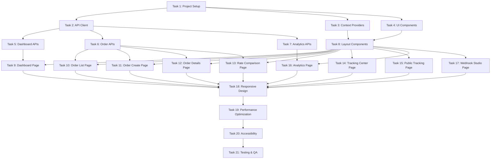

# Implementation Tasks — Frontend Redesign & API Enhancement

## Task Dependency Graph

---

## Phase 1: Foundation (Priority: Critical)

### Task 1: Project Setup & Folder Structure

**Priority:** Critical  
**Estimated Time:** 2 hours  
**Dependencies:** None

**Sub-tasks:**
1.1. Create new folder structure in zippy-frontend/src
1.2. Set up api/ directory with subdirectories
1.3. Set up components/ directory with ui/, layouts/, features/, common/
1.4. Set up contexts/, pages/, styles/, utils/

1.5. Create global.css with CSS variables (colors, spacing, typography)
1.6. Create utilities.css with utility classes
1.7. Create animations.css with keyframes
1.8. Set up constants.js with app constants
1.9. Create formatters.js and validators.js utilities
1.10. Update package.json with any missing dependencies

**Acceptance Criteria:**
- All folders exist with proper naming
- CSS variable system is defined
- Utility functions are created and exported
- No breaking changes to existing code

**Files to Create:**
- src/api/client.js
- src/api/endpoints/ (empty for now)
- src/api/hooks/ (empty for now)
- src/components/ui/ (empty for now)
- src/components/layouts/ (empty for now)
- src/components/features/ (empty for now)
- src/components/common/ (empty for now)
- src/contexts/ (empty for now)
- src/pages/ (empty for now)
- src/styles/global.css
- src/styles/utilities.css
- src/styles/animations.css
- src/utils/constants.js
- src/utils/formatters.js
- src/utils/validators.js

---

### Task 2: API Client Layer

**Priority:** Critical  
**Estimated Time:** 3 hours  
**Dependencies:** Task 1

**Sub-tasks:**
2.1. Create axios instance with base configuration (client.js)
2.2. Implement request interceptor for headers and logging
2.3. Implement response interceptor for error handling
2.4. Create api/hooks/useApi.js custom hook
2.5. Create api/hooks/usePolling.js custom hook
2.6. Create api/hooks/usePagination.js custom hook
2.7. Create placeholder endpoint modules (orders.js, rates.js, etc.)
2.8. Test API client with existing endpoints

**Acceptance Criteria:**
- Axios client configured with baseURL and timeout
- Interceptors handle errors and trigger notifications
- useApi hook works for GET/POST/PATCH/DELETE
- usePolling hook enables periodic data fetching
- All endpoint modules export functions

**Files to Create:**
- src/api/client.js
- src/api/hooks/useApi.js
- src/api/hooks/usePolling.js
- src/api/hooks/usePagination.js
- src/api/endpoints/orders.js
- src/api/endpoints/rates.js
- src/api/endpoints/shipments.js
- src/api/endpoints/tracking.js
- src/api/endpoints/dashboard.js
- src/api/endpoints/analytics.js

---

### Task 3: Context Providers

**Priority:** Critical  
**Estimated Time:** 2 hours  
**Dependencies:** Task 1

**Sub-tasks:**
3.1. Create ToastContext with provider and hook
3.2. Implement toast notification queue management
3.3. Create ToastContainer component for displaying toasts
3.4. Create ThemeContext with provider and hook (basic setup)
3.5. Wrap App.jsx with context providers
3.6. Test toast notifications work across app

**Acceptance Criteria:**
- ToastContext manages notification queue
- Toasts auto-dismiss after 5 seconds
- Toast types supported: success, error, warning, info
- useToast hook accessible from any component
- ThemeContext created for future enhancements

**Files to Create:**
- src/contexts/ToastContext.jsx
- src/contexts/ThemeContext.jsx
- src/components/ui/Toast/ToastContainer.jsx
- src/components/ui/Toast/Toast.jsx

---

### Task 4: Core UI Components

**Priority:** Critical  
**Estimated Time:** 6 hours  
**Dependencies:** Task 1

**Sub-tasks:**
4.1. Create Button component with variants and sizes
4.2. Create Input component with validation states
4.3. Create SearchInput component with icon
4.4. Create Select component
4.5. Create Card component
4.6. Create Modal component with overlay
4.7. Create Table component with sorting
4.8. Create Pagination component
4.9. Create StatusBadge component
4.10. Create Badge component
4.11. Create Skeleton loader components
4.12. Create EmptyState component
4.13. Create LoadingSpinner component
4.14. Write CSS for all components
4.15. Test all components in isolation

**Acceptance Criteria:**
- All components render correctly
- Components follow design system (colors, spacing)
- Components are reusable and accept props
- Loading states work properly
- Accessibility attributes present (ARIA labels)

**Files to Create:**
- src/components/ui/Button/Button.jsx
- src/components/ui/Button/Button.css
- src/components/ui/Input/Input.jsx
- src/components/ui/Input/SearchInput.jsx
- src/components/ui/Select/Select.jsx
- src/components/ui/Card/Card.jsx
- src/components/ui/Modal/Modal.jsx
- src/components/ui/Table/Table.jsx
- src/components/ui/Pagination/Pagination.jsx
- src/components/ui/StatusBadge/StatusBadge.jsx
- src/components/ui/Badge/Badge.jsx
- src/components/ui/Skeleton/Skeleton.jsx
- src/components/ui/EmptyState/EmptyState.jsx
- src/components/ui/LoadingSpinner/LoadingSpinner.jsx

---

## Phase 2: Backend APIs (Priority: Critical)

### Task 5: Dashboard APIs

**Priority:** Critical  
**Estimated Time:** 4 hours  
**Dependencies:** Task 2

**Sub-tasks:**
5.1. Create DashboardController.java in backend
5.2. Create DashboardService.java with business logic
5.3. Implement GET /api/dashboard/stats endpoint
5.4. Calculate totalOrders, activeShipments, deliveredToday, totalRevenue
5.5. Calculate courierBreakdown and statusBreakdown
5.6. Implement GET /api/dashboard/recent-orders endpoint
5.7. Create DashboardStatsResponse DTO
5.8. Create RecentOrdersResponse DTO
5.9. Write unit tests for dashboard service
5.10. Test endpoints with Postman
5.11. Update API_CONTRACTS.md documentation

**Acceptance Criteria:**
- Both endpoints return correct data
- Response time < 500ms
- Proper error handling
- Tests pass
- Documentation updated

**Files to Create/Modify:**
- zippy-backend/src/main/java/com/zippy/backend/controller/DashboardController.java
- zippy-backend/src/main/java/com/zippy/backend/service/DashboardService.java
- zippy-backend/src/main/java/com/zippy/backend/dto/response/DashboardStatsResponse.java
- zippy-backend/src/test/java/com/zippy/backend/service/DashboardServiceTest.java

---

### Task 6: Order Management APIs

**Priority:** Critical  
**Estimated Time:** 5 hours  
**Dependencies:** Task 2

**Sub-tasks:**
6.1. Enhance OrderController with new endpoints
6.2. Implement GET /api/orders with pagination support
6.3. Add query params: page, limit, sort, order, status, search
6.4. Implement GET /api/orders/search endpoint
6.5. Implement PATCH /api/orders/{id}/cancel endpoint
6.6. Create PaginatedOrderResponse DTO
6.7. Add custom query methods to OrderRepository
6.8. Implement search query (LIKE across multiple fields)
6.9. Add order cancellation logic (status validation)
6.10. Write unit tests for all new endpoints
6.11. Test with Postman
6.12. Update API_CONTRACTS.md

**Acceptance Criteria:**
- Pagination works correctly with metadata
- Sorting works for all specified fields
- Search finds orders across all relevant fields
- Cancel only works for valid statuses
- All tests pass
- Response times meet targets

**Files to Modify:**
- zippy-backend/src/main/java/com/zippy/backend/controller/OrderController.java
- zippy-backend/src/main/java/com/zippy/backend/service/OrderService.java
- zippy-backend/src/main/java/com/zippy/backend/repository/OrderRepository.java
- zippy-backend/src/main/java/com/zippy/backend/dto/response/PaginatedOrderResponse.java

---

### Task 7: Analytics & Tracking APIs

**Priority:** High  
**Estimated Time:** 4 hours  
**Dependencies:** Task 2

**Sub-tasks:**
7.1. Create AnalyticsController.java
7.2. Create AnalyticsService.java
7.3. Implement GET /api/analytics/courier-performance endpoint
7.4. Calculate metrics per courier (success rate, avg delivery time, cost)
7.5. Implement GET /api/analytics/order-trends endpoint
7.6. Calculate daily trends (order count, revenue)
7.7. Implement GET /api/shipments/active endpoint
7.8. Create TrackingController.java
7.9. Implement GET /api/tracking/public/{trackingNumber} endpoint
7.10. Sanitize response for public consumption
7.11. Create HealthController.java
7.12. Implement GET /api/health endpoint
7.13. Check database and courier connectivity
7.14. Write tests for all endpoints
7.15. Update API_CONTRACTS.md

**Acceptance Criteria:**
- Analytics calculations are accurate
- Public tracking doesn't expose sensitive data
- Health check shows service status correctly
- All tests pass
- Documentation updated

**Files to Create:**
- zippy-backend/src/main/java/com/zippy/backend/controller/AnalyticsController.java
- zippy-backend/src/main/java/com/zippy/backend/controller/TrackingController.java
- zippy-backend/src/main/java/com/zippy/backend/controller/HealthController.java
- zippy-backend/src/main/java/com/zippy/backend/service/AnalyticsService.java
- zippy-backend/src/main/java/com/zippy/backend/dto/response/CourierPerformanceResponse.java
- zippy-backend/src/main/java/com/zippy/backend/dto/response/OrderTrendsResponse.java
- zippy-backend/src/main/java/com/zippy/backend/dto/response/HealthResponse.java

---

## Phase 3: Layout & Navigation (Priority: Critical)

### Task 8: Layout Components & Router Setup

**Priority:** Critical  
**Estimated Time:** 4 hours  
**Dependencies:** Task 3, Task 4

**Sub-tasks:**
8.1. Create Sidebar component with navigation links
8.2. Create Navbar component with branding
8.3. Create AppLayout component (Sidebar + Navbar + Outlet)
8.4. Create PublicLayout component (for public tracking)
8.5. Create ErrorBoundary component
8.6. Create NotFound (404) page
8.7. Update App.jsx with React Router configuration
8.8. Set up all routes with layouts
8.9. Implement route protection logic (placeholder for future auth)
8.10. Test navigation between all pages
8.11. Verify browser back/forward works correctly

**Acceptance Criteria:**
- Sidebar displays on all main app pages
- Active route is highlighted in sidebar
- Public pages don't show sidebar
- 404 page displays for invalid routes
- Navigation is smooth without full page reload
- Browser history works correctly

**Files to Create:**
- src/components/layouts/AppLayout.jsx
- src/components/layouts/PublicLayout.jsx
- src/components/common/Sidebar.jsx
- src/components/common/Navbar.jsx
- src/components/common/ErrorBoundary.jsx
- src/pages/NotFound.jsx

**Files to Modify:**
- src/App.jsx (Router setup)

---

## Phase 4: Core Pages (Priority: Critical)

### Task 9: Dashboard Page

**Priority:** Critical  
**Estimated Time:** 4 hours  
**Dependencies:** Task 4, Task 5, Task 8

**Sub-tasks:**
9.1. Create Dashboard.jsx page component
9.2. Create StatsCard feature component
9.3. Create RecentOrdersTable feature component
9.4. Create CourierChart feature component (simple bar/pie chart)
9.5. Integrate dashboard stats API
9.6. Implement loading states with skeletons
9.7. Implement error handling
9.8. Add "Create New Order" CTA button
9.9. Style dashboard with grid layout
9.10. Make dashboard responsive
9.11. Add auto-refresh (optional, every 30 seconds)
9.12. Test dashboard with real and mock data

**Acceptance Criteria:**
- All 4 stat cards display correctly
- Recent orders table shows last 10 orders
- Courier distribution chart displays
- Loading states show while fetching
- Error handling works properly
- Responsive on mobile/tablet/desktop
- Links to create order and view order details work

**Files to Create:**
- src/pages/Dashboard.jsx
- src/components/features/dashboard/StatsCard.jsx
- src/components/features/dashboard/RecentOrdersTable.jsx
- src/components/features/dashboard/CourierChart.jsx

---

### Task 10: Order List Page

**Priority:** Critical  
**Estimated Time:** 5 hours  
**Dependencies:** Task 4, Task 6, Task 8

**Sub-tasks:**
10.1. Create OrderList.jsx page component
10.2. Integrate order list API with pagination
10.3. Implement search functionality with debouncing
10.4. Implement status filter dropdown
10.5. Implement table sorting (click headers)
10.6. Implement pagination controls
10.7. Add loading states with table skeleton
10.8. Add empty state for no results
10.9. Add "View" button navigation to order details
10.10. Add "Create Order" button
10.11. Style with proper spacing and layout
10.12. Make responsive for mobile
10.13. Test search, filter, sort, pagination

**Acceptance Criteria:**
- Order table displays with all columns
- Search updates results as user types (debounced 500ms)
- Status filter works correctly
- Sorting works on all sortable columns
- Pagination displays and works correctly
- Loading/empty states display appropriately
- Navigation to order details works
- Responsive design works on mobile

**Files to Create:**
- src/pages/OrderList.jsx
- src/components/features/orders/OrderTableRow.jsx (optional)

---

### Task 11: Order Create Page

**Priority:** Critical  
**Estimated Time:** 3 hours  
**Dependencies:** Task 4, Task 6, Task 8

**Sub-tasks:**
11.1. Migrate existing OrderForm.jsx to new structure
11.2. Create OrderCreate.jsx page wrapper
11.3. Update form validation with validators.js utilities
11.4. Integrate with order creation API
11.5. Add loading state on submit button
11.6. Add error handling with toast notifications
11.7. Navigate to rate comparison on success
11.8. Keep "Auto-Fill Sample Data" functionality
11.9. Update form styling to match design system
11.10. Make form responsive
11.11. Test form validation and submission

**Acceptance Criteria:**
- Form validates all inputs correctly
- Auto-fill generates randomized test data
- Loading state displays during submission
- Error messages display in toast notifications
- Success navigates to rate comparison
- Form is accessible (labels, aria attributes)
- Responsive on mobile devices

**Files to Create:**
- src/pages/OrderCreate.jsx

**Files to Migrate:**
- src/components/features/orders/OrderForm.jsx (from existing)

---

### Task 12: Order Details Page

**Priority:** Critical  
**Estimated Time:** 4 hours  
**Dependencies:** Task 4, Task 6, Task 8

**Sub-tasks:**
12.1. Create OrderDetails.jsx page component
12.2. Create OrderSummaryCard feature component
12.3. Create CustomerInfoCard feature component
12.4. Create AddressCard feature component
12.5. Create SelectedCarrierCard feature component
12.6. Create ShipmentInfoCard feature component
12.7. Integrate order details API
12.8. Integrate tracking API for status timeline
12.9. Implement "Cancel Order" button with confirmation modal
12.10. Add polling for active shipment updates (5 seconds)
12.11. Display status timeline with visual indicators
12.12. Add loading and error states
12.13. Make responsive
12.14. Test with orders in different statuses

**Acceptance Criteria:**
- All order information displays in organized sections
- Carrier and shipment info display when available
- Status timeline shows complete history
- Cancel button only shows for valid statuses
- Confirmation modal works before canceling
- Polling updates status automatically
- 404 displays if order not found
- Responsive layout works on all devices

**Files to Create:**
- src/pages/OrderDetails.jsx
- src/components/features/orders/OrderSummaryCard.jsx
- src/components/features/orders/CustomerInfoCard.jsx
- src/components/features/orders/AddressCard.jsx
- src/components/features/orders/SelectedCarrierCard.jsx
- src/components/features/orders/ShipmentInfoCard.jsx
- src/components/features/orders/StatusTimeline.jsx

---

### Task 13: Rate Comparison Page

**Priority:** Critical  
**Estimated Time:** 3 hours  
**Dependencies:** Task 4, Task 8

**Sub-tasks:**
13.1. Migrate RateComparisonTable.jsx to new structure
13.2. Create RateComparison.jsx page wrapper
13.3. Add color coding for cheapest/fastest rates
13.4. Add sort dropdown (price, delivery time, carrier)
13.5. Add confirmation modal for carrier selection
13.6. Integrate with carrier selection API
13.7. Integrate with shipment creation API
13.8. Show warning banner for failed couriers
13.9. Add loading states
13.10. Navigate to order details after shipment creation
13.11. Update styling to match design system
13.12. Make table responsive (horizontal scroll on mobile)
13.13. Test with various rate scenarios

**Acceptance Criteria:**
- Rate table displays all available options
- Cheapest rate highlighted in green
- Fastest rate highlighted in blue
- Sort functionality works correctly
- Confirmation modal shows before selection
- Loading states display during API calls
- Warning banner shows if courier failed
- Navigation works after shipment creation
- Responsive design handles mobile screens

**Files to Create:**
- src/pages/RateComparison.jsx

**Files to Migrate:**
- src/components/features/orders/RateComparisonTable.jsx

---

### Task 14: Tracking Center Page

**Priority:** High  
**Estimated Time:** 3 hours  
**Dependencies:** Task 4, Task 7, Task 8

**Sub-tasks:**
14.1. Create TrackingCenter.jsx page component
14.2. Create ActiveShipmentsTable feature component
14.3. Integrate active shipments API
14.4. Implement status filter dropdown
14.5. Implement table sorting
14.6. Add "View Details" button navigation
14.7. Add auto-refresh (every 30 seconds)
14.8. Add loading and empty states
14.9. Style with proper spacing
14.10. Make responsive
14.11. Test with active and completed shipments

**Acceptance Criteria:**
- Table displays all active shipments
- Status filter works correctly
- Sorting works on all columns
- Auto-refresh updates data every 30 seconds
- View Details navigates to order details
- Loading states display while fetching
- Empty state shows if no active shipments
- Responsive on all devices

**Files to Create:**
- src/pages/TrackingCenter.jsx
- src/components/features/tracking/ActiveShipmentsTable.jsx

---

### Task 15: Public Tracking Page

**Priority:** High  
**Estimated Time:** 3 hours  
**Dependencies:** Task 4, Task 7, Task 8

**Sub-tasks:**
15.1. Create PublicTracking.jsx page component
15.2. Create TrackingSearchForm component
15.3. Create PublicStatusTimeline component
15.4. Integrate public tracking API
15.5. Display sanitized tracking information
15.6. Show status timeline with events
15.7. Add "Track Another Shipment" functionality
15.8. Add loading and error states (tracking number not found)
15.9. Style for customer-friendly appearance
15.10. Make fully responsive
15.11. Test with valid and invalid tracking numbers

**Acceptance Criteria:**
- Tracking number can be entered via URL or form
- Public data displays correctly (no sensitive info)
- Status timeline shows all events
- Carrier name and delivery location display
- Error message for invalid tracking numbers
- "Track Another" resets the form
- Clean, customer-friendly design
- Works without authentication
- Mobile responsive

**Files to Create:**
- src/pages/PublicTracking.jsx
- src/components/features/tracking/TrackingSearchForm.jsx
- src/components/features/tracking/PublicStatusTimeline.jsx

---

### Task 16: Analytics Page

**Priority:** Medium  
**Estimated Time:** 4 hours  
**Dependencies:** Task 4, Task 7, Task 8

**Sub-tasks:**
16.1. Create Analytics.jsx page component
16.2. Create CourierPerformanceCard feature component
16.3. Create OrderTrendsChart feature component
16.4. Integrate courier performance API
16.5. Integrate order trends API
16.6. Implement period selector (7d, 30d, 90d)
16.7. Create simple chart visualizations (can use CSS bars or minimal library)
16.8. Add loading states
16.9. Add empty states for no data
16.10. Style analytics cards and charts
16.11. Make responsive
16.12. Test with different time periods

**Acceptance Criteria:**
- Courier performance metrics display correctly
- Order trends chart shows daily data
- Period selector changes the data
- Charts are visually clear and understandable
- Loading states display while fetching
- Empty state shows if no analytics data
- Responsive layout works on all devices

**Files to Create:**
- src/pages/Analytics.jsx
- src/components/features/analytics/CourierPerformanceCard.jsx
- src/components/features/analytics/OrderTrendsChart.jsx
- src/components/features/analytics/PeriodSelector.jsx

---

### Task 17: Webhook Studio Page

**Priority:** Medium  
**Estimated Time:** 3 hours  
**Dependencies:** Task 4, Task 8

**Sub-tasks:**
17.1. Migrate existing SimulationPanel.jsx to new structure
17.2. Create WebhookStudio.jsx page wrapper
17.3. Create ShipmentSelector component
17.4. Create StatusAdvancer component
17.5. Add tracking number input for manual selection
17.6. Add "Advance Status" functionality
17.7. Add "Set Specific Status" functionality
17.8. Show confirmation modal before triggering
17.9. Display webhook payload preview
17.10. Show success/error toast after webhook sent
17.11. Update styling to match design system
17.12. Test webhook simulation with different statuses

**Acceptance Criteria:**
- All active shipments listed for selection
- Manual tracking number input works
- Advance status triggers next status correctly
- Specific status setter works for testing
- Confirmation modal shows before sending
- Webhook payload preview displays
- Success/error feedback via toasts
- Status updates reflect in UI immediately

**Files to Create:**
- src/pages/WebhookStudio.jsx

**Files to Migrate:**
- src/components/features/webhook/SimulationPanel.jsx

---

## Phase 5: Polish & Optimization (Priority: Medium)

### Task 18: Responsive Design Implementation

**Priority:** Medium  
**Estimated Time:** 4 hours  
**Dependencies:** All page tasks (T9-T17)

**Sub-tasks:**
18.1. Review all pages on mobile viewport (375px)
18.2. Review all pages on tablet viewport (768px)
18.3. Review all pages on desktop viewport (1024px+)
18.4. Fix sidebar collapse/hamburger menu on mobile
18.5. Make all tables horizontally scrollable on mobile
18.6. Ensure buttons and inputs are touch-friendly (min 44px)
18.7. Fix stats card grid responsive layout
18.8. Test navigation on touch devices
18.9. Verify all text is readable without zooming
18.10. Fix any overflow issues
18.11. Test on Chrome Mobile, Safari Mobile, Firefox Mobile
18.12. Document responsive breakpoints

**Acceptance Criteria:**
- All pages work on mobile (375px width)
- All pages work on tablet (768px width)
- All pages work on desktop (1024px+ width)
- Sidebar collapses appropriately
- No horizontal scrolling except tables
- Touch targets are ≥ 44px
- Text is readable on all devices
- No layout breaking or overlap issues

**Files to Modify:**
- Update CSS in multiple component files
- src/styles/global.css (media queries)

---

### Task 19: Performance Optimization

**Priority:** Medium  
**Estimated Time:** 3 hours  
**Dependencies:** Task 18

**Sub-tasks:**
19.1. Implement code splitting with React.lazy() for pages
19.2. Add Suspense with loading fallback
19.3. Optimize images and assets
19.4. Minimize CSS and remove unused styles
19.5. Implement debouncing for search inputs
19.6. Add React.memo to expensive components
19.7. Verify no memory leaks in useEffect cleanup
19.8. Run Lighthouse audit and fix issues
19.9. Optimize bundle size (tree shaking)
19.10. Test page load times
19.11. Run production build and analyze bundle
19.12. Document performance metrics

**Acceptance Criteria:**
- Initial page load < 2 seconds on 4G
- Time to interactive < 3 seconds
- Bundle size < 500KB gzipped
- Lighthouse Performance score > 90
- No console errors or warnings
- Smooth 60fps animations
- Search debounced at 500ms
- Production build optimized

**Files to Modify:**
- src/App.jsx (lazy loading)
- Multiple component files (React.memo)
- vite.config.js (build optimization)

---

### Task 20: Accessibility Implementation

**Priority:** Medium  
**Estimated Time:** 4 hours  
**Dependencies:** Task 19

**Sub-tasks:**
20.1. Add keyboard navigation support to all interactive elements
20.2. Add visible focus indicators
20.3. Add ARIA labels to icon buttons
20.4. Add ARIA labels to form inputs
20.5. Add role="alert" to error messages
20.6. Verify color contrast ratios (4.5:1)
20.7. Add skip to main content link
20.8. Verify semantic heading hierarchy
20.9. Add proper table headers with scope
20.10. Implement focus trap in modals
20.11. Test with keyboard only (no mouse)
20.12. Run Lighthouse accessibility audit
20.13. Fix all accessibility issues found
20.14. Document accessibility features

**Acceptance Criteria:**
- All interactive elements accessible via keyboard
- Tab order is logical
- Focus indicators visible on all elements
- ARIA labels present where needed
- Color contrast meets WCAG 2.1 AA
- Semantic HTML used properly
- Modal focus trap works
- Lighthouse Accessibility score > 90
- Keyboard navigation tested and working

**Files to Modify:**
- All component files (add ARIA attributes)
- src/styles/global.css (focus styles)
- src/components/ui/Modal/Modal.jsx (focus trap)

---

### Task 21: Testing & Quality Assurance

**Priority:** Medium  
**Estimated Time:** 5 hours  
**Dependencies:** Task 20

**Sub-tasks:**
21.1. Test all pages with real backend data
21.2. Test order creation flow end-to-end
21.3. Test rate comparison and carrier selection
21.4. Test shipment tracking and status updates
21.5. Test webhook simulation triggers
21.6. Test search functionality thoroughly
21.7. Test pagination on large datasets
21.8. Test error handling (network errors, API errors)
21.9. Test loading states everywhere
21.10. Test responsive design on real devices
21.11. Test browser compatibility (Chrome, Firefox, Safari, Edge)
21.12. Fix all bugs found
21.13. Run final Lighthouse audit
21.14. Create test data for demo
21.15. Document testing results

**Acceptance Criteria:**
- All user flows work end-to-end
- No console errors in production
- All error states display properly
- All loading states work correctly
- Responsive design works on real devices
- Browser compatibility verified
- Lighthouse scores > 90
- Test data available for demo
- Known issues documented

**Files to Create:**
- docs/TESTING_RESULTS.md
- scratch/test-data.json (sample orders)

---

## Phase 6: Documentation & Deployment (Priority: Low)

### Task 22: Documentation Updates

**Priority:** Low  
**Estimated Time:** 2 hours  
**Dependencies:** Task 21

**Sub-tasks:**
22.1. Update README.md with new structure and setup
22.2. Update API_CONTRACTS.md with all new endpoints
22.3. Create/update Postman collection with new APIs
22.4. Document component usage in README
22.5. Document environment variables
22.6. Add screenshots to documentation
22.7. Create demo walkthrough guide
22.8. Update architecture diagrams if needed

**Acceptance Criteria:**
- README is up-to-date and accurate
- API documentation is complete
- Postman collection includes all endpoints
- Component documentation exists
- Environment variables documented
- Screenshots illustrate key features
- Demo guide is clear and concise

**Files to Modify:**
- README.md
- docs/API_CONTRACTS.md
- postman/zippy-logistics.postman_collection.json

**Files to Create:**
- docs/COMPONENT_LIBRARY.md
- docs/DEMO_GUIDE.md

---

### Task 23: Docker & Deployment

**Priority:** Low  
**Estimated Time:** 2 hours  
**Dependencies:** Task 22

**Sub-tasks:**
23.1. Update frontend Dockerfile if needed
23.2. Update docker-compose.yml with environment variables
23.3. Create nginx.conf for production
23.4. Create .env.production with correct API URLs
23.5. Test Docker build locally
23.6. Test full stack with docker-compose up
23.7. Verify all services communicate correctly
23.8. Test health check endpoint
23.9. Document deployment process
23.10. Create production deployment checklist

**Acceptance Criteria:**
- Docker build succeeds without errors
- docker-compose up starts all services
- Frontend can communicate with backend
- Environment variables configured correctly
- Health check endpoint responds
- Deployment documentation complete
- Production build tested

**Files to Modify:**
- zippy-frontend/Dockerfile
- docker-compose.yml
- zippy-frontend/.env.production

**Files to Create:**
- zippy-frontend/nginx.conf
- docs/DEPLOYMENT.md

---

## Summary

### Total Tasks: 23
### Total Estimated Time: 78 hours (approximately 10 working days)

### Priority Breakdown:
- **Critical Priority:** 13 tasks (56 hours)
- **High Priority:** 4 tasks (14 hours)
- **Medium Priority:** 5 tasks (18 hours)
- **Low Priority:** 2 tasks (4 hours)

### Suggested Implementation Order:

**Week 1 (Foundation & Backend):**
- Days 1-2: Tasks 1-4 (Foundation)
- Days 3-5: Tasks 5-7 (Backend APIs)

**Week 2 (Core UI):**
- Day 1: Task 8 (Layouts)
- Days 2-5: Tasks 9-13 (Core Pages)

**Week 3 (Features & Polish):**
- Days 1-2: Tasks 14-17 (Additional Pages)
- Days 3-5: Tasks 18-21 (Polish & Testing)

**Optional Week 4:**
- Tasks 22-23 (Documentation & Deployment)

### Key Milestones:
1. ✅ Foundation Complete (after Task 4)
2. ✅ Backend APIs Ready (after Task 7)
3. ✅ Navigation Working (after Task 8)
4. ✅ Core Features Done (after Task 13)
5. ✅ All Pages Complete (after Task 17)
6. ✅ Production Ready (after Task 21)
7. ✅ Deployment Ready (after Task 23)

---

## Notes for Implementation

- Tasks can be worked on in parallel where dependencies allow
- Backend tasks (5-7) can be done by one developer while frontend tasks (9-17) by another
- UI components (Task 4) can be built incrementally as needed by pages
- Testing should happen continuously, not just in Task 21
- Performance and accessibility should be considered during development, not just at the end

---

## Success Criteria

Implementation is complete when:
- ✅ All 23 tasks are marked as done
- ✅ All acceptance criteria met for each task
- ✅ No critical bugs remaining
- ✅ Lighthouse scores > 90
- ✅ All documentation updated
- ✅ Application works in Docker environment
- ✅ Demo ready for HR review
