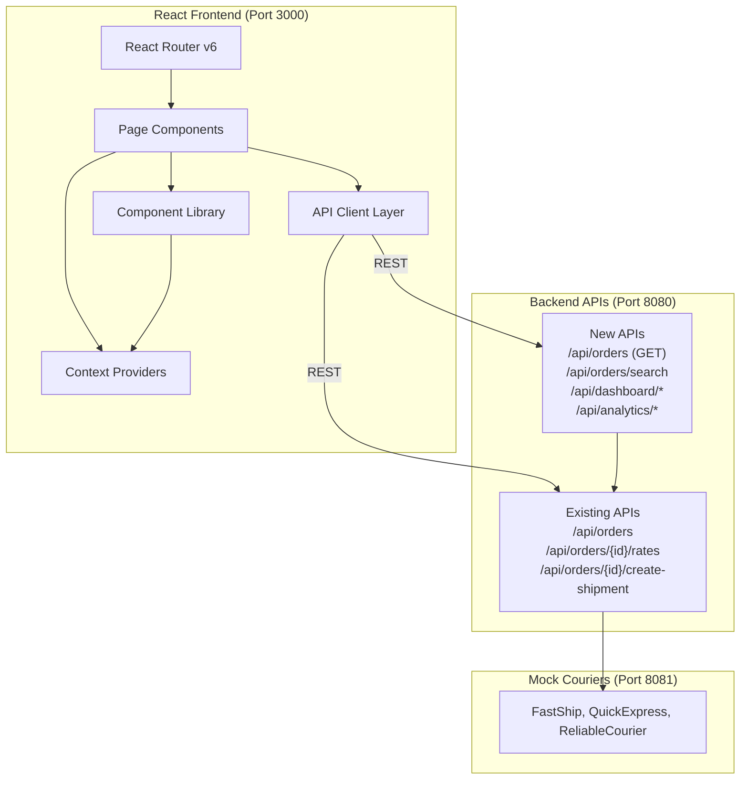
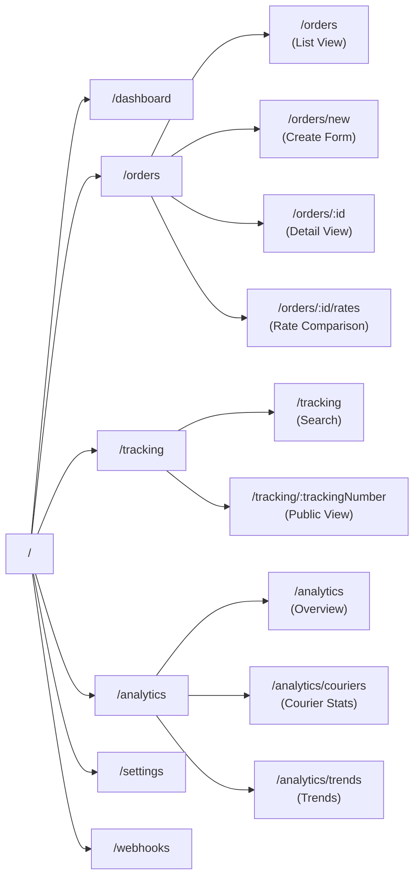

# Design Document: Zippy Logistics Platform Frontend Redesign & Backend API Enhancement

## Overview

This design transforms the Zippy Logistics Platform from a basic tab-based single-page application into a modern, production-ready logistics management system. The redesign addresses critical gaps in user experience, navigation, feature completeness, and backend API coverage while maintaining backward compatibility with existing functionality.

**Core Design Goals:**
1. **Modern React Architecture**: Full React Router v6 implementation replacing tab-based navigation
2. **Production-Grade UI/UX**: Professional design inspired by Vercel, Stripe Dashboard, and Linear with smooth animations and micro-interactions
3. **Comprehensive Feature Set**: Dashboard, order management, analytics, settings, and enhanced tracking
4. **Backend API Completeness**: New endpoints for order listing, search, dashboard stats, analytics, and bulk operations
5. **Reusable Component Library**: Custom-built components for buttons, inputs, modals, toasts, tables, and loading states
6. **Centralized API Client**: Axios-based service layer with interceptors, error handling, and retry logic
7. **State Management**: Context API for user preferences, notifications, and global state
8. **Responsive Design**: Mobile-first approach with breakpoints for tablet and desktop

**Design Philosophy:**
- Keep existing dependencies (no new heavy libraries like MUI or Ant Design)
- Build custom components for full control and performance
- Maintain core logistics flow (create → rates → ship → track)
- Ensure Docker compatibility and backward compatibility with existing backend

---

## Architecture

### High-Level System Architecture



### Frontend Component Architecture

```mermaid
graph TB
    subgraph "App Structure"
        App["App.jsx<br/>Router Setup"]
        Layout["Layout Components<br/>Navbar, Sidebar, Footer"]
    end

    subgraph "Page Layer"
        Dashboard["Dashboard"]
        OrderList["Order List"]
        OrderCreate["Create Order"]
        OrderDetail["Order Detail"]
        RateComparison["Rate Comparison"]
        Tracking["Tracking Center"]
        Analytics["Analytics"]
        Settings["Settings"]
        WebhookStudio["Webhook Studio"]
    end

    subgraph "Component Library"
        UI["UI Components<br/>Button, Input, Modal<br/>Toast, Badge, Card"]
        Data["Data Components<br/>DataTable, SearchBar<br/>FilterPanel, Pagination"]
        Feedback["Feedback Components<br/>LoadingSkeleton<br/>EmptyState, ErrorBoundary"]
        Visualization["Visualization<br/>Charts, Timeline<br/>StatusBadge, ProgressBar"]
    end

    subgraph "Context Layer"
        ThemeContext["Theme Context"]
        ToastContext["Toast Context"]
        PreferencesContext["Preferences Context"]
    end

    subgraph "Service Layer"
        APIClient["API Client<br/>Axios + Interceptors"]
        OrderService["Order Service"]
        DashboardService["Dashboard Service"]
        AnalyticsService["Analytics Service"]
    end

    App --> Layout
    App --> Page Layer
    Page Layer --> Component Library
    Page Layer --> Context Layer
    Page Layer --> Service Layer
    Component Library --> Context Layer

```

### Route Structure and Navigation Flow



---

## Components and Interfaces

### Core Layout Components

#### 1. AppLayout

**Purpose**: Root layout wrapper providing consistent structure across all pages

**Interface**:
```typescript
interface AppLayoutProps {
  children: React.ReactNode;
}

function AppLayout({ children }: AppLayoutProps): JSX.Element
```

**Responsibilities**:
- Render navigation sidebar
- Render top navbar with user info and global actions
- Provide main content area with responsive padding
- Integrate ToastContainer for notifications
- Wrap children in ErrorBoundary

**Component Structure**:
```jsx
<div className="app-layout">
  <Sidebar />
  <div className="main-wrapper">
    <Navbar />
    <main className="content-area">
      <ErrorBoundary>
        {children}
      </ErrorBoundary>
    </main>
  </div>
  <ToastContainer />
</div>
```

---

#### 2. Navbar

**Purpose**: Top navigation bar with branding, search, and user actions


**Interface**:
```typescript
interface NavbarProps {
  onSearchSubmit?: (query: string) => void;
}

function Navbar({ onSearchSubmit }: NavbarProps): JSX.Element
```

**Features**:
- Global search bar with keyboard shortcut (Cmd/Ctrl + K)
- Quick action buttons (Create Order, View Dashboard)
- User avatar and settings dropdown
- Notification bell with badge count

---

#### 3. Sidebar

**Purpose**: Left navigation sidebar with route links and collapsible sections

**Interface**:
```typescript
interface SidebarProps {
  collapsed?: boolean;
  onToggle?: () => void;
}

function Sidebar({ collapsed, onToggle }: SidebarProps): JSX.Element
```

**Navigation Structure**:
```typescript
const navItems = [
  { icon: 'dashboard', label: 'Dashboard', path: '/dashboard' },
  { icon: 'package', label: 'Orders', path: '/orders', badge: '12' },
  { icon: 'truck', label: 'Tracking', path: '/tracking' },
  { icon: 'chart', label: 'Analytics', path: '/analytics' },
  { icon: 'webhook', label: 'Webhooks', path: '/webhooks' },
  { icon: 'settings', label: 'Settings', path: '/settings' }
];
```

---

### Page Components

#### 4. Dashboard Page

**Purpose**: Overview page with stats, recent orders, and quick actions


**Data Requirements**:
```typescript
interface DashboardStats {
  totalOrders: number;
  activeShipments: number;
  deliveredToday: number;
  revenue: number;
  orderTrend: 'up' | 'down' | 'neutral';
  trendPercentage: number;
}

interface RecentOrder {
  orderId: string;
  merchantOrderId: string;
  customerName: string;
  status: OrderStatus;
  totalCharge: number;
  createdAt: string;
}
```

**Layout Structure**:
```jsx
<div className="dashboard-page">
  <PageHeader title="Dashboard" />
  
  <StatsGrid>
    <StatCard label="Total Orders" value={stats.totalOrders} icon="package" />
    <StatCard label="Active Shipments" value={stats.activeShipments} icon="truck" />
    <StatCard label="Delivered Today" value={stats.deliveredToday} icon="check" />
    <StatCard label="Revenue" value={formatCurrency(stats.revenue)} icon="dollar" />
  </StatsGrid>
  
  <div className="dashboard-grid">
    <RecentOrdersCard orders={recentOrders} />
    <QuickActionsCard />
    <OrderTrendsChart data={trendsData} />
    <CourierPerformanceCard stats={courierStats} />
  </div>
</div>
```

---

#### 5. Order List Page

**Purpose**: Searchable, filterable, sortable list of all orders with pagination


**Data Requirements**:
```typescript
interface OrderListParams {
  page: number;
  pageSize: number;
  sortBy?: 'createdAt' | 'totalCharge' | 'status';
  sortDirection?: 'asc' | 'desc';
  status?: OrderStatus[];
  searchQuery?: string;
  dateFrom?: string;
  dateTo?: string;
}

interface OrderListResponse {
  orders: Order[];
  totalCount: number;
  page: number;
  pageSize: number;
  totalPages: number;
}
```

**Features**:
- Advanced search (order ID, merchant ID, customer name/phone, tracking number)
- Multi-select status filter
- Date range filter
- Column sorting
- Bulk actions (export, cancel)
- Pagination controls
- Quick view modal

**Layout Structure**:
```jsx
<div className="order-list-page">
  <PageHeader 
    title="Orders" 
    actions={<Button onClick={navigateToCreate}>Create Order</Button>}
  />
  
  <FilterPanel>
    <SearchBar onSearch={handleSearch} placeholder="Search orders..." />
    <FilterDropdown label="Status" options={statusOptions} />
    <DateRangePicker onChange={handleDateRange} />
    <Button variant="secondary" onClick={handleReset}>Reset Filters</Button>
  </FilterPanel>
  
  <DataTable
    columns={columns}
    data={orders}
    sortable
    onSort={handleSort}
    loading={loading}
    emptyState={<EmptyState message="No orders found" />}
  />
  
  <Pagination
    currentPage={page}
    totalPages={totalPages}
    onPageChange={handlePageChange}
  />
</div>
```

---

#### 6. Order Detail Page

**Purpose**: Comprehensive view of a single order with all details and actions


**Layout Structure**:
```jsx
<div className="order-detail-page">
  <PageHeader 
    title={`Order ${order.orderId}`} 
    subtitle={order.merchantOrderId}
    actions={
      <>
        <Button variant="secondary" onClick={handlePrint}>Print</Button>
        {canCancel && <Button variant="danger" onClick={handleCancel}>Cancel Order</Button>}
      </>
    }
  />
  
  <div className="detail-grid">
    <Card title="Order Status">
      <StatusTimeline status={order.orderStatus} />
      {order.shipment && (
        <ShipmentInfo 
          carrier={order.shipment.carrierCode}
          trackingNumber={order.shipment.trackingNumber}
          currentStatus={order.shipment.currentStatus}
        />
      )}
    </Card>
    
    <Card title="Customer Details">
      <DetailRow label="Name" value={order.customer.name} />
      <DetailRow label="Phone" value={order.customer.phone} />
      <DetailRow label="Email" value={order.customer.email} />
    </Card>
    
    <Card title="Addresses">
      <AddressBlock label="Pickup" address={order.pickupAddress} />
      <AddressBlock label="Delivery" address={order.deliveryAddress} />
    </Card>
    
    <Card title="Package Details">
      <DetailRow label="Weight" value={`${order.package.weightGrams}g`} />
      <DetailRow label="Dimensions" value={formatDimensions(order.package)} />
      <DetailRow label="Payment" value={order.paymentType} />
      {order.codAmount && <DetailRow label="COD Amount" value={formatCurrency(order.codAmount)} />}
    </Card>
    
    {order.shipment && (
      <Card title="Tracking Events">
        <TrackingTimeline events={order.shipment.events} />
      </Card>
    )}
  </div>
</div>
```

---

#### 7. Rate Comparison Page (Enhanced)

**Purpose**: Enhanced version of existing rate comparison with better UX


**Enhancements**:
- Visual rate comparison cards (alternative to table)
- Side-by-side comparison mode (select 2-3 carriers)
- Historical rate tracking (if rate was fetched before)
- Rate details breakdown (expandable sections)
- Recommended carrier badge based on criteria
- Save preferred carriers feature

**Layout Options**:
```jsx
<div className="rate-comparison-page">
  <PageHeader title="Compare Courier Rates" />
  
  <ViewToggle>
    <ToggleButton active={view === 'table'} onClick={() => setView('table')}>Table</ToggleButton>
    <ToggleButton active={view === 'cards'} onClick={() => setView('cards')}>Cards</ToggleButton>
  </ViewToggle>
  
  <FilterBar>
    <SortDropdown options={['Price: Low to High', 'Speed: Fast to Slow', 'Carrier Name']} />
    <FilterCheckbox label="Show only COD" />
    <FilterCheckbox label="Show only Air" />
  </FilterBar>
  
  {view === 'table' ? (
    <RateTable rates={rates} onSelect={handleSelect} />
  ) : (
    <RateCardsGrid rates={rates} onSelect={handleSelect} />
  )}
  
  <ComparisonBar selectedRates={selectedForComparison} />
</div>
```

---

#### 8. Tracking Center Page

**Purpose**: Customer-facing and internal tracking interface

**Features**:
- Public tracking (no auth required)
- Multi-order tracking (track multiple shipments)
- Real-time status updates (polling/SSE)
- Estimated delivery date
- Delivery proof (if available)
- Share tracking link
- Subscribe to notifications

**Layout Structure**:
```jsx
<div className="tracking-page">
  <PageHeader title="Track Your Shipment" />
  
  <SearchSection>
    <SearchInput 
      placeholder="Enter tracking number or order ID"
      onSearch={handleSearch}
    />
    <RecentSearches searches={recentSearches} onClick={handleRecentClick} />
  </SearchSection>
  
  {trackingData && (
    <TrackingResult>
      <ShipmentHeader 
        trackingNumber={trackingData.trackingNumber}
        carrier={trackingData.carrier}
        currentStatus={trackingData.currentStatus}
      />
      
      <StatusTimeline events={trackingData.events} />
      
      <ShipmentDetails 
        estimatedDelivery={trackingData.estimatedDelivery}
        origin={trackingData.origin}
        destination={trackingData.destination}
      />
      
      {trackingData.proofOfDelivery && (
        <ProofOfDelivery data={trackingData.proofOfDelivery} />
      )}
      
      <ShareButton onClick={handleShare}>Share Tracking Link</ShareButton>
    </TrackingResult>
  )}
</div>
```

---

### Reusable Component Library

#### 9. Button Component

**Purpose**: Consistent button styles across all variants


**Interface**:
```typescript
interface ButtonProps {
  variant?: 'primary' | 'secondary' | 'outline' | 'ghost' | 'danger';
  size?: 'sm' | 'md' | 'lg';
  loading?: boolean;
  disabled?: boolean;
  icon?: React.ReactNode;
  iconPosition?: 'left' | 'right';
  fullWidth?: boolean;
  onClick?: () => void;
  type?: 'button' | 'submit' | 'reset';
  children: React.ReactNode;
}
```

**Implementation**:
```jsx
function Button({
  variant = 'primary',
  size = 'md',
  loading = false,
  disabled = false,
  icon,
  iconPosition = 'left',
  fullWidth = false,
  onClick,
  type = 'button',
  children
}: ButtonProps) {
  const className = `btn btn-${variant} btn-${size} ${fullWidth ? 'btn-full' : ''}`;
  
  return (
    <button 
      className={className}
      onClick={onClick}
      disabled={disabled || loading}
      type={type}
    >
      {loading && <Spinner size="sm" />}
      {!loading && icon && iconPosition === 'left' && icon}
      <span>{children}</span>
      {!loading && icon && iconPosition === 'right' && icon}
    </button>
  );
}
```

**Styling Guidelines**:
```css
.btn {
  display: inline-flex;
  align-items: center;
  gap: 0.5rem;
  border-radius: var(--radius-md);
  font-weight: 600;
  transition: all 0.15s ease;
  cursor: pointer;
}

.btn-primary {
  background: var(--color-white);
  color: var(--color-black);
  border: none;
}

.btn-primary:hover {
  opacity: 0.85;
  transform: translateY(-1px);
}

.btn-secondary {
  background: var(--bg-card);
  color: var(--text-white);
  border: 1px solid var(--border-color);
}

.btn-outline {
  background: transparent;
  color: var(--text-white);
  border: 1px solid var(--border-color);
}

.btn-ghost {
  background: transparent;
  color: var(--text-muted);
  border: none;
}

.btn-danger {
  background: var(--color-red);
  color: var(--color-white);
  border: none;
}
```

---

#### 10. Input Component

**Purpose**: Text input with validation states and icons


**Interface**:
```typescript
interface InputProps {
  type?: 'text' | 'email' | 'tel' | 'number' | 'password' | 'search';
  label?: string;
  placeholder?: string;
  value: string;
  onChange: (value: string) => void;
  error?: string;
  disabled?: boolean;
  required?: boolean;
  icon?: React.ReactNode;
  iconPosition?: 'left' | 'right';
  helperText?: string;
}
```

**Implementation**:
```jsx
function Input({
  type = 'text',
  label,
  placeholder,
  value,
  onChange,
  error,
  disabled,
  required,
  icon,
  iconPosition = 'left',
  helperText
}: InputProps) {
  return (
    <div className="input-wrapper">
      {label && (
        <label className="input-label">
          {label}
          {required && <span className="required">*</span>}
        </label>
      )}
      
      <div className={`input-container ${error ? 'input-error' : ''}`}>
        {icon && iconPosition === 'left' && (
          <span className="input-icon input-icon-left">{icon}</span>
        )}
        
        <input
          type={type}
          className="input"
          placeholder={placeholder}
          value={value}
          onChange={(e) => onChange(e.target.value)}
          disabled={disabled}
          required={required}
        />
        
        {icon && iconPosition === 'right' && (
          <span className="input-icon input-icon-right">{icon}</span>
        )}
      </div>
      
      {error && <span className="input-error-text">{error}</span>}
      {helperText && !error && <span className="input-helper-text">{helperText}</span>}
    </div>
  );
}
```

---

#### 11. Modal/Dialog Component

**Purpose**: Overlay modal for confirmations, forms, and content display


**Interface**:
```typescript
interface ModalProps {
  open: boolean;
  onClose: () => void;
  title?: string;
  size?: 'sm' | 'md' | 'lg' | 'xl';
  showCloseButton?: boolean;
  closeOnOverlayClick?: boolean;
  footer?: React.ReactNode;
  children: React.ReactNode;
}
```

**Implementation**:
```jsx
function Modal({
  open,
  onClose,
  title,
  size = 'md',
  showCloseButton = true,
  closeOnOverlayClick = true,
  footer,
  children
}: ModalProps) {
  if (!open) return null;
  
  return (
    <div 
      className="modal-overlay" 
      onClick={closeOnOverlayClick ? onClose : undefined}
    >
      <div 
        className={`modal-content modal-${size}`}
        onClick={(e) => e.stopPropagation()}
      >
        {(title || showCloseButton) && (
          <div className="modal-header">
            {title && <h2 className="modal-title">{title}</h2>}
            {showCloseButton && (
              <button className="modal-close" onClick={onClose}>×</button>
            )}
          </div>
        )}
        
        <div className="modal-body">
          {children}
        </div>
        
        {footer && (
          <div className="modal-footer">
            {footer}
          </div>
        )}
      </div>
    </div>
  );
}
```

---

#### 12. Toast Notification System

**Purpose**: Global toast notifications for success, error, info, and warning messages

**Interface**:
```typescript
interface Toast {
  id: string;
  type: 'success' | 'error' | 'info' | 'warning';
  message: string;
  duration?: number;
}

interface ToastContextValue {
  toasts: Toast[];
  showToast: (type: Toast['type'], message: string, duration?: number) => void;
  removeToast: (id: string) => void;
}
```

**Context Provider**:
```jsx
function ToastProvider({ children }: { children: React.ReactNode }) {
  const [toasts, setToasts] = useState<Toast[]>([]);
  
  const showToast = (type: Toast['type'], message: string, duration = 5000) => {
    const id = `toast-${Date.now()}-${Math.random()}`;
    const toast: Toast = { id, type, message, duration };
    
    setToasts(prev => [...prev, toast]);
    
    if (duration > 0) {
      setTimeout(() => removeToast(id), duration);
    }
  };
  
  const removeToast = (id: string) => {
    setToasts(prev => prev.filter(t => t.id !== id));
  };
  
  return (
    <ToastContext.Provider value={{ toasts, showToast, removeToast }}>
      {children}
      <ToastContainer toasts={toasts} onRemove={removeToast} />
    </ToastContext.Provider>
  );
}
```

**Usage Example**:
```jsx
const { showToast } = useToast();

// Success
showToast('success', 'Order created successfully!');

// Error
showToast('error', 'Failed to create shipment');

// Info
showToast('info', 'Rates are being fetched...', 3000);
```

---

#### 13. DataTable Component

**Purpose**: Sortable, filterable data table with pagination


**Interface**:
```typescript
interface Column<T> {
  key: string;
  header: string;
  sortable?: boolean;
  width?: string;
  render?: (row: T) => React.ReactNode;
}

interface DataTableProps<T> {
  columns: Column<T>[];
  data: T[];
  keyExtractor: (row: T) => string;
  loading?: boolean;
  sortBy?: string;
  sortDirection?: 'asc' | 'desc';
  onSort?: (key: string) => void;
  emptyState?: React.ReactNode;
  rowClassName?: (row: T) => string;
  onRowClick?: (row: T) => void;
}
```

**Implementation**:
```jsx
function DataTable<T>({
  columns,
  data,
  keyExtractor,
  loading,
  sortBy,
  sortDirection,
  onSort,
  emptyState,
  rowClassName,
  onRowClick
}: DataTableProps<T>) {
  if (loading) {
    return <LoadingSkeleton rows={5} columns={columns.length} />;
  }
  
  if (data.length === 0) {
    return emptyState || <EmptyState message="No data available" />;
  }
  
  return (
    <div className="table-wrapper">
      <table className="data-table">
        <thead>
          <tr>
            {columns.map(col => (
              <th 
                key={col.key}
                style={{ width: col.width }}
                onClick={col.sortable && onSort ? () => onSort(col.key) : undefined}
                className={col.sortable ? 'sortable' : ''}
              >
                {col.header}
                {sortBy === col.key && (
                  <span className="sort-icon">
                    {sortDirection === 'asc' ? '↑' : '↓'}
                  </span>
                )}
              </th>
            ))}
          </tr>
        </thead>
        <tbody>
          {data.map(row => (
            <tr 
              key={keyExtractor(row)}
              className={rowClassName?.(row)}
              onClick={onRowClick ? () => onRowClick(row) : undefined}
            >
              {columns.map(col => (
                <td key={col.key}>
                  {col.render ? col.render(row) : (row as any)[col.key]}
                </td>
              ))}
            </tr>
          ))}
        </tbody>
      </table>
    </div>
  );
}
```

---

#### 14. Loading Skeleton

**Purpose**: Placeholder UI during data loading

**Interface**:
```typescript
interface LoadingSkeletonProps {
  rows?: number;
  columns?: number;
  type?: 'table' | 'card' | 'text';
  height?: string;
}
```

**Implementation**:
```jsx
function LoadingSkeleton({ rows = 3, columns = 4, type = 'table', height }: LoadingSkeletonProps) {
  if (type === 'table') {
    return (
      <div className="skeleton-table">
        <div className="skeleton-row skeleton-header">
          {Array.from({ length: columns }).map((_, i) => (
            <div key={i} className="skeleton-cell" />
          ))}
        </div>
        {Array.from({ length: rows }).map((_, rowIdx) => (
          <div key={rowIdx} className="skeleton-row">
            {Array.from({ length: columns }).map((_, colIdx) => (
              <div key={colIdx} className="skeleton-cell" />
            ))}
          </div>
        ))}
      </div>
    );
  }
  
  if (type === 'card') {
    return (
      <div className="skeleton-card" style={{ height }}>
        <div className="skeleton-title" />
        <div className="skeleton-text" />
        <div className="skeleton-text" />
      </div>
    );
  }
  
  return <div className="skeleton-text" style={{ height }} />;
}
```

---

## Data Models

### Frontend TypeScript Interfaces


```typescript
// Core Order Model
interface Order {
  orderId: string;                    // ZPY-ORD-10001
  merchantOrderId: string;
  customer: {
    name: string;
    phone: string;
    email: string;
  };
  pickupAddress: Address;
  deliveryAddress: Address;
  package: {
    weightGrams: number;
    lengthCm: number;
    widthCm: number;
    heightCm: number;
  };
  paymentType: 'PREPAID' | 'COD';
  codAmount?: number;
  orderStatus: OrderStatus;
  selectedCarrier?: CarrierSelection;
  shipment?: Shipment;
  createdAt: string;
  updatedAt: string;
}

interface Address {
  addressLine1: string;
  city: string;
  state: string;
  pincode: string;
}

type OrderStatus = 
  | 'ORDER_CREATED'
  | 'CARRIER_SELECTED'
  | 'SHIPMENT_CREATED'
  | 'CANCELLED';

// Shipping Rate Model
interface ShippingOption {
  carrierCode: string;
  carrierName: string;
  serviceCode: string;
  serviceName: string;
  baseCharge: number;
  codCharge: number;
  additionalCharges: number;
  tax: number;
  totalCharge: number;
  estimatedMinDays: number;
  estimatedMaxDays: number;
}

interface RateResponse {
  orderId: string;
  shippingOptions: ShippingOption[];
  warnings: Array<{
    carrierCode: string;
    message: string;
  }>;
}

// Carrier Selection Model
interface CarrierSelection {
  carrierCode: string;
  serviceCode: string;
  quotedAmount: number;
  selectedAt: string;
}

// Shipment Model
interface Shipment {
  carrierCode: string;
  carrierShipmentId: string;
  trackingNumber: string;
  serviceCode: string;
  quotedAmount: number;
  currentStatus: ShipmentStatus;
  events: ShipmentEvent[];
  createdAt: string;
  updatedAt: string;
}

type ShipmentStatus =
  | 'SHIPMENT_CREATED'
  | 'PICKED_UP'
  | 'IN_TRANSIT'
  | 'OUT_FOR_DELIVERY'
  | 'DELIVERED'
  | 'DELIVERY_FAILED'
  | 'RTO';

interface ShipmentEvent {
  status: ShipmentStatus;
  description: string;
  location?: string;
  eventTime: string;
}

// Dashboard Models
interface DashboardStats {
  totalOrders: number;
  activeShipments: number;
  deliveredToday: number;
  revenue: number;
  orderTrend: {
    direction: 'up' | 'down' | 'neutral';
    percentage: number;
  };
}

interface RecentOrder {
  orderId: string;
  merchantOrderId: string;
  customerName: string;
  status: OrderStatus;
  totalCharge: number;
  createdAt: string;
}

// Analytics Models
interface CourierPerformance {
  carrierCode: string;
  carrierName: string;
  totalShipments: number;
  deliveredCount: number;
  avgDeliveryDays: number;
  deliverySuccessRate: number;
}

interface OrderTrend {
  date: string;
  orderCount: number;
  revenue: number;
}

// Search and Filter Models
interface OrderSearchParams {
  query?: string;
  status?: OrderStatus[];
  dateFrom?: string;
  dateTo?: string;
  page?: number;
  pageSize?: number;
  sortBy?: string;
  sortDirection?: 'asc' | 'desc';
}

interface PaginatedResponse<T> {
  data: T[];
  totalCount: number;
  page: number;
  pageSize: number;
  totalPages: number;
}
```

---

## New Backend API Endpoints

### 1. GET /api/orders - List All Orders

**Purpose**: Retrieve paginated list of orders with filtering and sorting


**Query Parameters**:
- `page` (number, default: 1) - Page number
- `pageSize` (number, default: 20, max: 100) - Items per page
- `sortBy` (string) - Sort field: `createdAt`, `totalCharge`, `status`
- `sortDirection` (string) - `asc` or `desc`
- `status` (string[]) - Filter by order status (comma-separated)
- `dateFrom` (ISO date) - Filter orders created after this date
- `dateTo` (ISO date) - Filter orders created before this date

**Request Example**:
```
GET /api/orders?page=1&pageSize=20&sortBy=createdAt&sortDirection=desc&status=SHIPMENT_CREATED,IN_TRANSIT
```

**Response (200 OK)**:
```json
{
  "orders": [
    {
      "orderId": "ZPY-ORD-10001",
      "merchantOrderId": "MERCHANT-10001",
      "customerName": "Rahul Sharma",
      "orderStatus": "SHIPMENT_CREATED",
      "totalCharge": 182.90,
      "carrier": "FASTSHIP",
      "trackingNumber": "FST123456789",
      "createdAt": "2026-07-15T09:00:00Z"
    }
  ],
  "totalCount": 150,
  "page": 1,
  "pageSize": 20,
  "totalPages": 8
}
```

**Error Responses**:
- 400: Invalid query parameters

---

### 2. GET /api/orders/search - Search Orders

**Purpose**: Full-text search across orders by multiple criteria

**Query Parameters**:
- `q` (string, required) - Search query
- `page` (number, default: 1)
- `pageSize` (number, default: 20)

**Search Scope**:
- Order ID (ZPY-ORD-*)
- Merchant Order ID
- Customer name
- Customer phone
- Tracking number

**Request Example**:
```
GET /api/orders/search?q=rahul&page=1&pageSize=10
```

**Response (200 OK)**:
```json
{
  "results": [
    {
      "orderId": "ZPY-ORD-10001",
      "merchantOrderId": "MERCHANT-10001",
      "customerName": "Rahul Sharma",
      "customerPhone": "9876543210",
      "orderStatus": "DELIVERED",
      "trackingNumber": "FST123456789",
      "matchField": "customerName",
      "createdAt": "2026-07-15T09:00:00Z"
    }
  ],
  "totalCount": 3,
  "page": 1,
  "pageSize": 10,
  "totalPages": 1
}
```

**Error Responses**:
- 400: Missing or invalid query parameter

---

### 3. GET /api/dashboard/stats - Dashboard Statistics

**Purpose**: Aggregate statistics for dashboard overview

**Response (200 OK)**:
```json
{
  "totalOrders": 1250,
  "activeShipments": 87,
  "deliveredToday": 23,
  "revenue": 125400.50,
  "orderTrend": {
    "direction": "up",
    "percentage": 12.5,
    "comparisonPeriod": "last_7_days"
  },
  "statusBreakdown": {
    "ORDER_CREATED": 15,
    "CARRIER_SELECTED": 8,
    "SHIPMENT_CREATED": 12,
    "PICKED_UP": 18,
    "IN_TRANSIT": 34,
    "OUT_FOR_DELIVERY": 15,
    "DELIVERED": 1140,
    "DELIVERY_FAILED": 5,
    "RTO": 3
  }
}
```

**Notes**:
- `revenue` is sum of all `quotedAmount` for completed shipments
- `orderTrend` compares current period vs previous period
- `deliveredToday` counts shipments with DELIVERED status today

---

### 4. GET /api/dashboard/recent-orders - Recent Orders

**Purpose**: Retrieve most recent orders for dashboard

**Query Parameters**:
- `limit` (number, default: 10, max: 50) - Number of orders to return

**Request Example**:
```
GET /api/dashboard/recent-orders?limit=10
```

**Response (200 OK)**:
```json
{
  "orders": [
    {
      "orderId": "ZPY-ORD-10015",
      "merchantOrderId": "MERCHANT-10015",
      "customerName": "Priya Patel",
      "orderStatus": "IN_TRANSIT",
      "totalCharge": 197.06,
      "carrier": "QUICKEXPRESS",
      "createdAt": "2026-07-20T14:30:00Z"
    }
  ]
}
```

---

### 5. GET /api/analytics/courier-performance - Courier Performance Analytics

**Purpose**: Compare courier reliability and performance metrics

**Query Parameters**:
- `period` (string, default: "30d") - Time period: `7d`, `30d`, `90d`, `1y`

**Request Example**:
```
GET /api/analytics/courier-performance?period=30d
```

**Response (200 OK)**:
```json
{
  "period": "30d",
  "couriers": [
    {
      "carrierCode": "FASTSHIP",
      "carrierName": "FastShip",
      "totalShipments": 450,
      "deliveredCount": 442,
      "deliverySuccessRate": 98.2,
      "avgDeliveryDays": 2.1,
      "onTimeDeliveryRate": 95.5,
      "avgCost": 185.50
    },
    {
      "carrierCode": "QUICKEXPRESS",
      "carrierName": "QuickExpress",
      "totalShipments": 380,
      "deliveredCount": 368,
      "deliverySuccessRate": 96.8,
      "avgDeliveryDays": 2.8,
      "onTimeDeliveryRate": 92.1,
      "avgCost": 195.20
    },
    {
      "carrierCode": "RELIABLE",
      "carrierName": "ReliableCourier",
      "totalShipments": 420,
      "deliveredCount": 415,
      "deliverySuccessRate": 98.8,
      "avgDeliveryDays": 4.2,
      "onTimeDeliveryRate": 97.3,
      "avgCost": 165.75
    }
  ]
}
```

---

### 6. GET /api/analytics/order-trends - Order Volume Trends

**Purpose**: Track order volume and revenue over time


**Query Parameters**:
- `period` (string, default: "7d") - Time period: `7d`, `30d`, `90d`
- `groupBy` (string, default: "day") - Grouping: `day`, `week`, `month`

**Request Example**:
```
GET /api/analytics/order-trends?period=30d&groupBy=day
```

**Response (200 OK)**:
```json
{
  "period": "30d",
  "groupBy": "day",
  "data": [
    {
      "date": "2026-07-01",
      "orderCount": 42,
      "revenue": 8450.25,
      "avgOrderValue": 201.20
    },
    {
      "date": "2026-07-02",
      "orderCount": 38,
      "revenue": 7890.50,
      "avgOrderValue": 207.64
    }
  ]
}
```

---

### 7. POST /api/orders/bulk-export - Export Orders

**Purpose**: Export orders to CSV or JSON format

**Request Body**:
```json
{
  "format": "csv",
  "filters": {
    "status": ["DELIVERED", "IN_TRANSIT"],
    "dateFrom": "2026-07-01T00:00:00Z",
    "dateTo": "2026-07-31T23:59:59Z"
  },
  "fields": ["orderId", "merchantOrderId", "customerName", "status", "totalCharge", "createdAt"]
}
```

**Response (200 OK)**:
```json
{
  "exportId": "EXP-2026-07-20-001",
  "format": "csv",
  "status": "completed",
  "downloadUrl": "/api/exports/EXP-2026-07-20-001/download",
  "recordCount": 847,
  "createdAt": "2026-07-20T15:30:00Z",
  "expiresAt": "2026-07-21T15:30:00Z"
}
```

**CSV Format Example**:
```csv
orderId,merchantOrderId,customerName,status,totalCharge,createdAt
ZPY-ORD-10001,MERCHANT-10001,Rahul Sharma,DELIVERED,182.90,2026-07-15T09:00:00Z
ZPY-ORD-10002,MERCHANT-10002,Priya Patel,IN_TRANSIT,197.06,2026-07-16T10:15:00Z
```

---

### 8. PATCH /api/orders/{orderId}/cancel - Cancel Order

**Purpose**: Cancel an order before shipment creation

**Request Body**:
```json
{
  "reason": "Customer requested cancellation",
  "cancelledBy": "admin"
}
```

**Response (200 OK)**:
```json
{
  "orderId": "ZPY-ORD-10001",
  "orderStatus": "CANCELLED",
  "cancelledAt": "2026-07-20T16:00:00Z",
  "reason": "Customer requested cancellation"
}
```

**Error Responses**:
- 404: Order not found
- 409: Cannot cancel order - shipment already created

**Business Rules**:
- Can only cancel orders in `ORDER_CREATED` or `CARRIER_SELECTED` status
- Once shipment is created, cancellation requires contacting courier
- Cancelled orders are excluded from active shipment counts

---

### 9. GET /api/tracking/public/{trackingNumber} - Public Tracking

**Purpose**: Public tracking page accessible without authentication

**Request Example**:
```
GET /api/tracking/public/FST123456789
```

**Response (200 OK)**:
```json
{
  "trackingNumber": "FST123456789",
  "carrier": {
    "code": "FASTSHIP",
    "name": "FastShip"
  },
  "currentStatus": "OUT_FOR_DELIVERY",
  "estimatedDelivery": "2026-07-17",
  "origin": {
    "city": "Bengaluru",
    "state": "Karnataka",
    "pincode": "560001"
  },
  "destination": {
    "city": "New Delhi",
    "state": "Delhi",
    "pincode": "110001"
  },
  "events": [
    {
      "status": "SHIPMENT_CREATED",
      "description": "Shipment booked with FastShip",
      "eventTime": "2026-07-15T09:06:00Z"
    },
    {
      "status": "PICKED_UP",
      "description": "Shipment picked up from merchant",
      "eventTime": "2026-07-15T14:00:00Z"
    },
    {
      "status": "IN_TRANSIT",
      "description": "Shipment departed Bengaluru hub",
      "location": "Bengaluru Hub",
      "eventTime": "2026-07-16T10:30:00Z"
    },
    {
      "status": "OUT_FOR_DELIVERY",
      "description": "Out for delivery to customer",
      "location": "New Delhi",
      "eventTime": "2026-07-17T08:15:00Z"
    }
  ]
}
```

**Error Responses**:
- 404: Tracking number not found

**Security Considerations**:
- No authentication required
- Returns limited information (no customer PII like phone, email, full address)
- Only shows city/state/pincode level location
- Rate limited to prevent abuse

---

### 10. GET /api/shipments/active - List Active Shipments

**Purpose**: Retrieve all in-transit shipments with real-time status

**Query Parameters**:
- `carrier` (string, optional) - Filter by carrier code
- `status` (string[], optional) - Filter by shipment status

**Request Example**:
```
GET /api/shipments/active?status=IN_TRANSIT,OUT_FOR_DELIVERY
```

**Response (200 OK)**:
```json
{
  "shipments": [
    {
      "orderId": "ZPY-ORD-10012",
      "trackingNumber": "FST123456790",
      "carrier": "FASTSHIP",
      "currentStatus": "IN_TRANSIT",
      "lastUpdate": "2026-07-20T10:30:00Z",
      "estimatedDelivery": "2026-07-21",
      "destination": {
        "city": "Mumbai",
        "pincode": "400001"
      }
    }
  ],
  "totalCount": 87
}
```

---

### 11. POST /api/webhooks/simulate - Simulate Webhook Events (Enhanced)

**Purpose**: Trigger webhook events for testing (moved from frontend mock)

**Request Body**:
```json
{
  "trackingNumber": "FST123456789",
  "carrier": "FASTSHIP",
  "event": {
    "type": "statusUpdate",
    "status": "DELIVERED",
    "description": "Package delivered successfully",
    "location": "New Delhi",
    "timestamp": "2026-07-20T16:00:00Z"
  }
}
```

**Response (200 OK)**:
```json
{
  "success": true,
  "message": "Webhook event processed",
  "shipmentId": "12345",
  "previousStatus": "OUT_FOR_DELIVERY",
  "newStatus": "DELIVERED"
}
```

---

### 12. GET /api/health - System Health Check

**Purpose**: Backend health check with courier connectivity status

**Response (200 OK)**:
```json
{
  "status": "healthy",
  "timestamp": "2026-07-20T16:30:00Z",
  "version": "1.0.0",
  "services": {
    "database": {
      "status": "up",
      "responseTime": 15
    },
    "couriers": {
      "FASTSHIP": {
        "status": "up",
        "lastCheck": "2026-07-20T16:29:45Z",
        "responseTime": 120
      },
      "QUICKEXPRESS": {
        "status": "up",
        "lastCheck": "2026-07-20T16:29:45Z",
        "responseTime": 95
      },
      "RELIABLE": {
        "status": "down",
        "lastCheck": "2026-07-20T16:29:45Z",
        "error": "Connection timeout"
      }
    }
  }
}
```

---

## API Client Architecture

### Centralized Axios Client with Interceptors


**File Structure**:
```
src/api/
├── client.ts              # Axios instance configuration
├── interceptors.ts        # Request/response interceptors
├── services/
│   ├── orderService.ts    # Order-related API calls
│   ├── rateService.ts     # Rate aggregation API calls
│   ├── shipmentService.ts # Shipment API calls
│   ├── dashboardService.ts # Dashboard API calls
│   ├── analyticsService.ts # Analytics API calls
│   └── trackingService.ts  # Tracking API calls
└── types.ts               # Shared API types
```

**Axios Client Configuration**:
```typescript
// api/client.ts
import axios, { AxiosInstance, AxiosRequestConfig } from 'axios';
import { setupInterceptors } from './interceptors';

const config: AxiosRequestConfig = {
  baseURL: import.meta.env.VITE_API_BASE_URL || 'http://localhost:8080',
  timeout: 15000,
  headers: {
    'Content-Type': 'application/json',
  },
};

const apiClient: AxiosInstance = axios.create(config);

setupInterceptors(apiClient);

export default apiClient;
```

**Request/Response Interceptors**:
```typescript
// api/interceptors.ts
import { AxiosInstance, AxiosError, InternalAxiosRequestConfig, AxiosResponse } from 'axios';
import { useToast } from '../contexts/ToastContext';

export function setupInterceptors(client: AxiosInstance) {
  // Request interceptor
  client.interceptors.request.use(
    (config: InternalAxiosRequestConfig) => {
      // Add auth token if available
      const token = localStorage.getItem('authToken');
      if (token && config.headers) {
        config.headers.Authorization = `Bearer ${token}`;
      }
      
      // Log request in dev mode
      if (import.meta.env.DEV) {
        console.log(`[API Request] ${config.method?.toUpperCase()} ${config.url}`, config.data);
      }
      
      return config;
    },
    (error) => {
      return Promise.reject(error);
    }
  );

  // Response interceptor
  client.interceptors.response.use(
    (response: AxiosResponse) => {
      // Log response in dev mode
      if (import.meta.env.DEV) {
        console.log(`[API Response] ${response.config.method?.toUpperCase()} ${response.config.url}`, response.data);
      }
      
      return response;
    },
    async (error: AxiosError) => {
      const originalRequest = error.config;
      
      // Handle 401 Unauthorized (if auth is implemented)
      if (error.response?.status === 401 && originalRequest) {
        // Redirect to login or refresh token
        window.location.href = '/login';
        return Promise.reject(error);
      }
      
      // Handle 503 Service Unavailable with retry logic
      if (error.response?.status === 503 && originalRequest && !originalRequest._retry) {
        originalRequest._retry = true;
        await new Promise(resolve => setTimeout(resolve, 2000)); // Wait 2s
        return client(originalRequest);
      }
      
      // Extract error message
      const errorMessage = 
        (error.response?.data as any)?.message || 
        error.message || 
        'An unexpected error occurred';
      
      // Show error toast for client errors (4xx, 5xx)
      if (error.response && error.response.status >= 400) {
        console.error(`[API Error] ${error.response.status}:`, errorMessage);
      }
      
      return Promise.reject(error);
    }
  );
}

// Custom axios request config to track retries
declare module 'axios' {
  export interface InternalAxiosRequestConfig {
    _retry?: boolean;
  }
}
```

**Service Layer Example - Order Service**:
```typescript
// api/services/orderService.ts
import apiClient from '../client';
import { Order, OrderSearchParams, PaginatedResponse, OrderCreateRequest } from '../types';

export const orderService = {
  // List orders with pagination and filters
  async listOrders(params: OrderSearchParams): Promise<PaginatedResponse<Order>> {
    const { data } = await apiClient.get<PaginatedResponse<Order>>('/api/orders', { params });
    return data;
  },

  // Search orders
  async searchOrders(query: string, page = 1, pageSize = 20): Promise<PaginatedResponse<Order>> {
    const { data } = await apiClient.get<PaginatedResponse<Order>>('/api/orders/search', {
      params: { q: query, page, pageSize }
    });
    return data;
  },

  // Get single order
  async getOrder(orderId: string): Promise<Order> {
    const { data } = await apiClient.get<Order>(`/api/orders/${orderId}`);
    return data;
  },

  // Create order
  async createOrder(orderData: OrderCreateRequest): Promise<Order> {
    const { data } = await apiClient.post<Order>('/api/orders', orderData);
    return data;
  },

  // Cancel order
  async cancelOrder(orderId: string, reason: string): Promise<Order> {
    const { data } = await apiClient.patch<Order>(`/api/orders/${orderId}/cancel`, { reason });
    return data;
  },

  // Export orders
  async exportOrders(filters: any, format: 'csv' | 'json'): Promise<{ downloadUrl: string }> {
    const { data } = await apiClient.post('/api/orders/bulk-export', { filters, format });
    return data;
  }
};
```

**Service Layer Example - Dashboard Service**:
```typescript
// api/services/dashboardService.ts
import apiClient from '../client';
import { DashboardStats, RecentOrder } from '../types';

export const dashboardService = {
  async getStats(): Promise<DashboardStats> {
    const { data } = await apiClient.get<DashboardStats>('/api/dashboard/stats');
    return data;
  },

  async getRecentOrders(limit = 10): Promise<{ orders: RecentOrder[] }> {
    const { data } = await apiClient.get('/api/dashboard/recent-orders', { params: { limit } });
    return data;
  }
};
```

---

## State Management with Context API

### Toast Context (Global Notifications)


```typescript
// contexts/ToastContext.tsx
import React, { createContext, useContext, useState, useCallback } from 'react';

interface Toast {
  id: string;
  type: 'success' | 'error' | 'info' | 'warning';
  message: string;
  duration: number;
}

interface ToastContextValue {
  toasts: Toast[];
  showToast: (type: Toast['type'], message: string, duration?: number) => void;
  removeToast: (id: string) => void;
}

const ToastContext = createContext<ToastContextValue | undefined>(undefined);

export function ToastProvider({ children }: { children: React.ReactNode }) {
  const [toasts, setToasts] = useState<Toast[]>([]);

  const showToast = useCallback((
    type: Toast['type'],
    message: string,
    duration = 5000
  ) => {
    const id = `toast-${Date.now()}-${Math.random()}`;
    const toast: Toast = { id, type, message, duration };

    setToasts(prev => [...prev, toast]);

    if (duration > 0) {
      setTimeout(() => removeToast(id), duration);
    }
  }, []);

  const removeToast = useCallback((id: string) => {
    setToasts(prev => prev.filter(t => t.id !== id));
  }, []);

  return (
    <ToastContext.Provider value={{ toasts, showToast, removeToast }}>
      {children}
    </ToastContext.Provider>
  );
}

export function useToast() {
  const context = useContext(ToastContext);
  if (!context) {
    throw new Error('useToast must be used within ToastProvider');
  }
  return context;
}
```

### Preferences Context (User Settings)

```typescript
// contexts/PreferencesContext.tsx
import React, { createContext, useContext, useState, useEffect } from 'react';

interface Preferences {
  theme: 'dark' | 'light';
  tableDensity: 'comfortable' | 'compact' | 'spacious';
  defaultPageSize: number;
  preferredCouriers: string[];
}

interface PreferencesContextValue {
  preferences: Preferences;
  updatePreference: <K extends keyof Preferences>(key: K, value: Preferences[K]) => void;
}

const DEFAULT_PREFERENCES: Preferences = {
  theme: 'dark',
  tableDensity: 'comfortable',
  defaultPageSize: 20,
  preferredCouriers: []
};

const PreferencesContext = createContext<PreferencesContextValue | undefined>(undefined);

export function PreferencesProvider({ children }: { children: React.ReactNode }) {
  const [preferences, setPreferences] = useState<Preferences>(() => {
    const stored = localStorage.getItem('userPreferences');
    return stored ? JSON.parse(stored) : DEFAULT_PREFERENCES;
  });

  useEffect(() => {
    localStorage.setItem('userPreferences', JSON.stringify(preferences));
  }, [preferences]);

  const updatePreference = <K extends keyof Preferences>(key: K, value: Preferences[K]) => {
    setPreferences(prev => ({ ...prev, [key]: value }));
  };

  return (
    <PreferencesContext.Provider value={{ preferences, updatePreference }}>
      {children}
    </PreferencesContext.Provider>
  );
}

export function usePreferences() {
  const context = useContext(PreferencesContext);
  if (!context) {
    throw new Error('usePreferences must be used within PreferencesProvider');
  }
  return context;
}
```

---

## File and Folder Structure

### Complete Frontend Directory Structure

```
zippy-frontend/
├── public/
│   ├── favicon.ico
│   └── logo.svg
├── src/
│   ├── main.tsx                          # App entry point
│   ├── App.tsx                           # Router setup
│   ├── api/                              # API client layer
│   │   ├── client.ts
│   │   ├── interceptors.ts
│   │   ├── types.ts
│   │   └── services/
│   │       ├── orderService.ts
│   │       ├── rateService.ts
│   │       ├── shipmentService.ts
│   │       ├── dashboardService.ts
│   │       ├── analyticsService.ts
│   │       └── trackingService.ts
│   ├── components/                       # Reusable components
│   │   ├── layout/
│   │   │   ├── AppLayout.tsx
│   │   │   ├── Navbar.tsx
│   │   │   ├── Sidebar.tsx
│   │   │   └── Footer.tsx
│   │   ├── ui/                           # Base UI components
│   │   │   ├── Button.tsx
│   │   │   ├── Input.tsx
│   │   │   ├── Select.tsx
│   │   │   ├── Modal.tsx
│   │   │   ├── Toast.tsx
│   │   │   ├── Badge.tsx
│   │   │   ├── Card.tsx
│   │   │   ├── Spinner.tsx
│   │   │   └── Tooltip.tsx
│   │   ├── data/                         # Data display components
│   │   │   ├── DataTable.tsx
│   │   │   ├── Pagination.tsx
│   │   │   ├── SearchBar.tsx
│   │   │   ├── FilterPanel.tsx
│   │   │   └── SortDropdown.tsx
│   │   ├── feedback/                     # Feedback components
│   │   │   ├── LoadingSkeleton.tsx
│   │   │   ├── EmptyState.tsx
│   │   │   ├── ErrorBoundary.tsx
│   │   │   └── ProgressBar.tsx
│   │   ├── forms/                        # Form components
│   │   │   ├── FormGroup.tsx
│   │   │   ├── FormError.tsx
│   │   │   ├── DatePicker.tsx
│   │   │   └── FileUpload.tsx
│   │   └── domain/                       # Domain-specific components
│   │       ├── OrderForm.tsx
│   │       ├── RateTable.tsx
│   │       ├── RateCard.tsx
│   │       ├── StatusBadge.tsx
│   │       ├── StatusTimeline.tsx
│   │       ├── TrackingTimeline.tsx
│   │       ├── AddressBlock.tsx
│   │       ├── StatCard.tsx
│   │       └── CourierLogo.tsx
│   ├── pages/                            # Page components
│   │   ├── Dashboard.tsx
│   │   ├── orders/
│   │   │   ├── OrderList.tsx
│   │   │   ├── OrderCreate.tsx
│   │   │   ├── OrderDetail.tsx
│   │   │   └── OrderRates.tsx
│   │   ├── tracking/
│   │   │   ├── TrackingSearch.tsx
│   │   │   └── TrackingPublic.tsx
│   │   ├── analytics/
│   │   │   ├── AnalyticsOverview.tsx
│   │   │   ├── CourierPerformance.tsx
│   │   │   └── OrderTrends.tsx
│   │   ├── webhooks/
│   │   │   └── WebhookStudio.tsx
│   │   └── settings/
│   │       └── Settings.tsx
│   ├── contexts/                         # React contexts
│   │   ├── ToastContext.tsx
│   │   └── PreferencesContext.tsx
│   ├── hooks/                            # Custom hooks
│   │   ├── usePolling.ts
│   │   ├── useDebounce.ts
│   │   ├── usePagination.ts
│   │   └── useModal.ts
│   ├── utils/                            # Utility functions
│   │   ├── formatters.ts                 # Date, currency, number formatters
│   │   ├── validators.ts                 # Form validators
│   │   ├── constants.ts                  # App constants
│   │   └── helpers.ts                    # Helper functions
│   ├── styles/                           # Global styles
│   │   ├── index.css                     # Main stylesheet
│   │   ├── variables.css                 # CSS variables
│   │   ├── animations.css                # Animations
│   │   └── responsive.css                # Responsive breakpoints
│   └── types/                            # TypeScript types
│       ├── order.ts
│       ├── shipment.ts
│       ├── rate.ts
│       └── common.ts
├── .env.development
├── .env.production
├── package.json
├── tsconfig.json
├── vite.config.ts
└── README.md
```

---

## Styling System

### CSS Variables (Design Tokens)


```css
/* styles/variables.css */
:root {
  /* Colors - Dark Theme */
  --color-black: #000000;
  --color-white: #ffffff;
  --color-gray-50: #fafafa;
  --color-gray-100: #f5f5f5;
  --color-gray-200: #e5e5e5;
  --color-gray-300: #d4d4d4;
  --color-gray-400: #a3a3a3;
  --color-gray-500: #737373;
  --color-gray-600: #525252;
  --color-gray-700: #404040;
  --color-gray-800: #262626;
  --color-gray-900: #171717;
  --color-gray-950: #0a0a0a;

  /* Semantic Colors */
  --bg-primary: var(--color-black);
  --bg-secondary: var(--color-gray-950);
  --bg-tertiary: var(--color-gray-900);
  --bg-card: var(--color-gray-950);
  --bg-card-hover: var(--color-gray-900);
  --bg-input: var(--color-black);

  --text-primary: var(--color-white);
  --text-secondary: var(--color-gray-300);
  --text-tertiary: var(--color-gray-400);
  --text-muted: var(--color-gray-500);

  --border-primary: var(--color-gray-800);
  --border-secondary: var(--color-gray-700);
  --border-active: var(--color-gray-600);

  /* Status Colors */
  --color-success: #10b981;
  --color-success-light: #d1fae5;
  --color-error: #ef4444;
  --color-error-light: #fee2e2;
  --color-warning: #f59e0b;
  --color-warning-light: #fef3c7;
  --color-info: #3b82f6;
  --color-info-light: #dbeafe;

  /* Spacing */
  --space-1: 0.25rem;
  --space-2: 0.5rem;
  --space-3: 0.75rem;
  --space-4: 1rem;
  --space-5: 1.25rem;
  --space-6: 1.5rem;
  --space-8: 2rem;
  --space-10: 2.5rem;
  --space-12: 3rem;
  --space-16: 4rem;

  /* Border Radius */
  --radius-sm: 0.375rem;
  --radius-md: 0.5rem;
  --radius-lg: 0.75rem;
  --radius-xl: 1rem;
  --radius-full: 9999px;

  /* Shadows */
  --shadow-sm: 0 1px 2px rgba(0, 0, 0, 0.05);
  --shadow-md: 0 4px 6px rgba(0, 0, 0, 0.1);
  --shadow-lg: 0 10px 15px rgba(0, 0, 0, 0.2);
  --shadow-xl: 0 20px 25px rgba(0, 0, 0, 0.3);
  --shadow-card: 0 4px 24px rgba(0, 0, 0, 0.95);

  /* Typography */
  --font-sans: 'Plus Jakarta Sans', -apple-system, BlinkMacSystemFont, 'Segoe UI', 'Roboto', sans-serif;
  --font-heading: 'Outfit', var(--font-sans);
  --font-mono: 'JetBrains Mono', 'Fira Code', 'Courier New', monospace;

  --font-size-xs: 0.75rem;
  --font-size-sm: 0.875rem;
  --font-size-base: 1rem;
  --font-size-lg: 1.125rem;
  --font-size-xl: 1.25rem;
  --font-size-2xl: 1.5rem;
  --font-size-3xl: 1.875rem;
  --font-size-4xl: 2.25rem;

  --font-weight-normal: 400;
  --font-weight-medium: 500;
  --font-weight-semibold: 600;
  --font-weight-bold: 700;

  /* Line Heights */
  --line-height-tight: 1.25;
  --line-height-normal: 1.5;
  --line-height-relaxed: 1.75;

  /* Transitions */
  --transition-fast: 150ms ease;
  --transition-base: 200ms ease;
  --transition-slow: 300ms ease;

  /* Z-Index */
  --z-dropdown: 1000;
  --z-sticky: 1100;
  --z-modal-backdrop: 1200;
  --z-modal: 1300;
  --z-toast: 1400;
  --z-tooltip: 1500;

  /* Container Max Widths */
  --container-sm: 640px;
  --container-md: 768px;
  --container-lg: 1024px;
  --container-xl: 1280px;
  --container-2xl: 1536px;
}
```

### Animation System

```css
/* styles/animations.css */

/* Fade animations */
@keyframes fadeIn {
  from {
    opacity: 0;
  }
  to {
    opacity: 1;
  }
}

@keyframes fadeOut {
  from {
    opacity: 1;
  }
  to {
    opacity: 0;
  }
}

/* Slide animations */
@keyframes slideInFromRight {
  from {
    transform: translateX(100%);
    opacity: 0;
  }
  to {
    transform: translateX(0);
    opacity: 1;
  }
}

@keyframes slideInFromBottom {
  from {
    transform: translateY(20px);
    opacity: 0;
  }
  to {
    transform: translateY(0);
    opacity: 1;
  }
}

/* Scale animations */
@keyframes scaleIn {
  from {
    transform: scale(0.95);
    opacity: 0;
  }
  to {
    transform: scale(1);
    opacity: 1;
  }
}

/* Shimmer for loading skeleton */
@keyframes shimmer {
  0% {
    background-position: -1000px 0;
  }
  100% {
    background-position: 1000px 0;
  }
}

/* Utility classes */
.fade-in {
  animation: fadeIn var(--transition-base);
}

.slide-in-right {
  animation: slideInFromRight var(--transition-slow);
}

.slide-in-bottom {
  animation: slideInFromBottom var(--transition-base);
}

.scale-in {
  animation: scaleIn var(--transition-fast);
}

/* Micro-interactions */
.hover-lift {
  transition: transform var(--transition-fast);
}

.hover-lift:hover {
  transform: translateY(-2px);
}

.hover-glow {
  transition: box-shadow var(--transition-base);
}

.hover-glow:hover {
  box-shadow: 0 0 20px rgba(255, 255, 255, 0.1);
}

/* Pulse animation for badges */
@keyframes pulse {
  0%, 100% {
    opacity: 1;
  }
  50% {
    opacity: 0.5;
  }
}

.pulse {
  animation: pulse 2s cubic-bezier(0.4, 0, 0.6, 1) infinite;
}
```

### Responsive Breakpoints

```css
/* styles/responsive.css */

/* Mobile First Approach */

/* Small devices (phones, 640px and up) */
@media (min-width: 640px) {
  .container {
    max-width: var(--container-sm);
  }
}

/* Medium devices (tablets, 768px and up) */
@media (min-width: 768px) {
  .container {
    max-width: var(--container-md);
  }
  
  .sidebar {
    display: block;
  }
  
  .mobile-menu-toggle {
    display: none;
  }
}

/* Large devices (desktops, 1024px and up) */
@media (min-width: 1024px) {
  .container {
    max-width: var(--container-lg);
  }
  
  .dashboard-grid {
    grid-template-columns: repeat(2, 1fr);
  }
}

/* Extra large devices (large desktops, 1280px and up) */
@media (min-width: 1280px) {
  .container {
    max-width: var(--container-xl);
  }
  
  .dashboard-grid {
    grid-template-columns: repeat(3, 1fr);
  }
}

/* 2XL devices (very large desktops, 1536px and up) */
@media (min-width: 1536px) {
  .container {
    max-width: var(--container-2xl);
  }
}

/* Mobile-specific styles */
@media (max-width: 767px) {
  .sidebar {
    position: fixed;
    left: -100%;
    transition: left var(--transition-base);
  }
  
  .sidebar.open {
    left: 0;
  }
  
  .data-table {
    display: block;
    overflow-x: auto;
  }
  
  .mobile-hidden {
    display: none;
  }
}
```

---

## Error Handling Strategy

### Error Boundary Component
