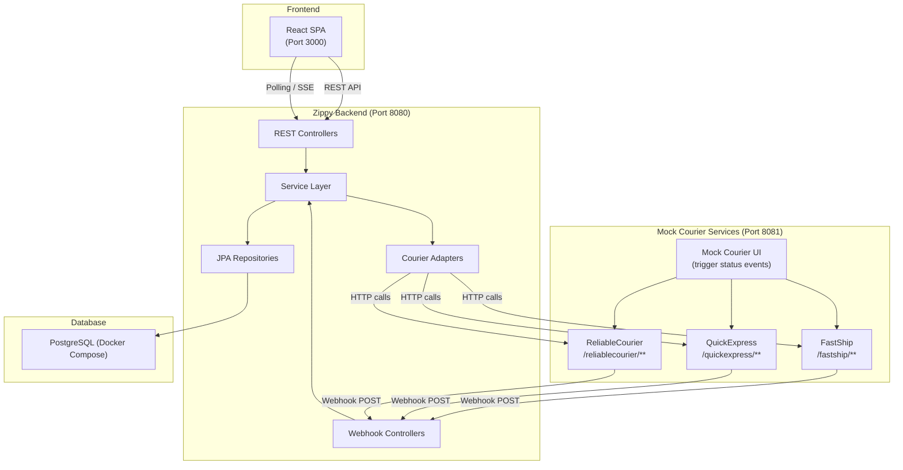
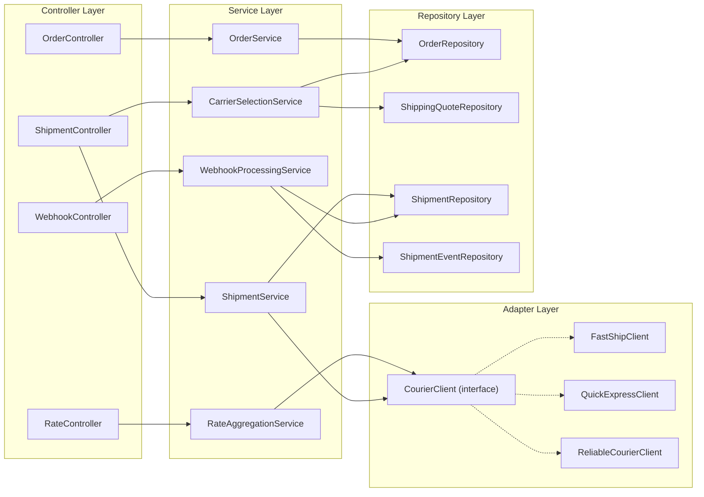

# Architecture — Zippy Mock Logistics Platform

## High-Level Component Diagram



---

## Backend Layering



---

## Courier Adapter / Strategy Pattern

### Design

All three courier integrations implement a common `CourierClient` interface. The
`RateAggregationService` and `ShipmentService` operate against this interface, never against
concrete implementations. This enables:

- Adding a 4th courier without modifying service-layer code
- Consistent error/timeout handling across all couriers
- Easy unit testing via mocks

### Interface Contract

```java
public interface CourierClient {

    /** Unique carrier code, e.g. "FASTSHIP" */
    String getCarrierCode();

    /** Human-readable name, e.g. "FastShip" */
    String getCarrierName();

    /**
     * Fetch rate(s) for the given order.
     * Returns one or more normalized shipping options.
     * Throws CourierUnavailableException on failure/timeout.
     */
    List<NormalizedShippingOption> getRates(Order order);

    /**
     * Create a shipment with this courier.
     * Returns carrier shipment ID and tracking number.
     * Throws CourierUnavailableException on failure/timeout.
     */
    ShipmentCreationResult createShipment(Order order, ShippingQuote selectedQuote);

    /**
     * Parse a raw webhook payload into a normalized shipment event.
     * Returns empty Optional if the payload is malformed or unrecognizable.
     */
    Optional<NormalizedShipmentEvent> parseWebhookEvent(String rawPayload);
}
```

### Adapter Registration

All `CourierClient` implementations are Spring `@Component`s. The `RateAggregationService`
injects them as a `List<CourierClient>` — Spring auto-collects all implementations. No manual
registration or factory needed.

```java
@Service
public class RateAggregationService {
    private final List<CourierClient> courierClients;

    public RateAggregationService(List<CourierClient> courierClients) {
        this.courierClients = courierClients;
    }
}
```

### Per-Adapter Mapping

Each concrete adapter (e.g. `FastShipClient`) is responsible for:
1. **Request mapping** — converting `Order` fields to the courier's request format
2. **HTTP call** — using `WebClient` with a configured timeout
3. **Response mapping** — converting the courier's response to `NormalizedShippingOption`
4. **Error wrapping** — catching HTTP/timeout errors and throwing `CourierUnavailableException`

---

## Mock Courier Structure Decision

**Decision: Single Spring Boot application with isolated packages per courier.**

### Rationale

| Option | Pros | Cons |
|--------|------|------|
| 3 separate Spring Boot apps | Full isolation, realistic microservice simulation | 3x startup time, 3x memory, Docker Compose complexity for a demo |
| 1 app with isolated packages | Single JVM, simple setup, still clearly separated code | Shares a classpath (acceptable for mocks) |

For a take-home assignment that's never deployed to production:
- **Developer experience matters** — `docker compose up` starts 3 containers (frontend, backend+DB,
  mock-couriers) instead of 5
- **Clear separation is achieved via packages** — `com.zippy.mockcourier.fastship`,
  `com.zippy.mockcourier.quickexpress`, `com.zippy.mockcourier.reliable`, each with their own
  controller, service, and DTOs
- **No shared state** between courier packages — they behave as independent services that happen to
  share a JVM
- A mock UI endpoint (or REST triggers) in the mock-courier app allows manually advancing shipment
  status for demo/testing

### Package Structure (Mock Courier App)

```
mock-courier-service/
├── src/main/java/com/zippy/mockcourier/
│   ├── MockCourierApplication.java
│   ├── fastship/
│   │   ├── FastShipController.java
│   │   ├── FastShipService.java
│   │   └── dto/
│   ├── quickexpress/
│   │   ├── QuickExpressController.java
│   │   ├── QuickExpressService.java
│   │   └── dto/
│   ├── reliable/
│   │   ├── ReliableCourierController.java
│   │   ├── ReliableCourierService.java
│   │   └── dto/
│   └── common/
│       ├── MockShipmentStore.java      // In-memory shipment state
│       └── StatusAdvancementService.java // Timer or manual trigger
```

---

## Carrier Selection + Shipment Creation: One API or Two?

**Decision: Two separate APIs.**

| Endpoint | Purpose |
|----------|---------|
| `POST /api/orders/{orderId}/select-carrier` | Persists carrier choice, freezes quoted amount |
| `POST /api/orders/{orderId}/create-shipment` | Calls courier API, creates Shipment record |

### Rationale

1. **Explicit confirmation step** — The frontend can show a confirmation dialog between selection and
   shipment creation. Once a shipment is created with a courier, it can't easily be undone.
2. **Separation of concerns** — Selection is a local operation (DB write). Shipment creation involves
   an external HTTP call that can fail. Keeping them separate makes retry logic cleaner.
3. **Status granularity** — `CARRIER_SELECTED` vs `SHIPMENT_CREATED` gives clear audit trail.
4. **Spec alignment** — The spec lists both endpoints in its "Suggested Zippy APIs" section,
   indicating the two-step flow is the intended design.

---

## Concurrency / Timeout Strategy for Rate Aggregation

### Approach: `WebClient` + `CompletableFuture` with Per-Call Timeout

```java
public List<NormalizedShippingOption> aggregateRates(Order order) {
    List<CompletableFuture<List<NormalizedShippingOption>>> futures = courierClients.stream()
        .map(client -> CompletableFuture.supplyAsync(() -> client.getRates(order))
            .orTimeout(COURIER_TIMEOUT_SECONDS, TimeUnit.SECONDS)
            .exceptionally(ex -> {
                log.warn("Courier {} failed: {}", client.getCarrierCode(), ex.getMessage());
                return Collections.emptyList();
            }))
        .toList();

    return futures.stream()
        .map(CompletableFuture::join)
        .flatMap(Collection::stream)
        .toList();
}
```

### Configuration

| Setting | Value | Rationale |
|---------|-------|-----------|
| Per-courier HTTP connect timeout | 2 seconds | Fail fast if courier host is unreachable |
| Per-courier HTTP read timeout | 5 seconds | Allow for slow but responding couriers |
| `CompletableFuture.orTimeout` | 5 seconds | Hard cap matching read timeout |
| Thread pool | Virtual threads (Java 21) or `ForkJoinPool.commonPool()` | Lightweight for 3 concurrent calls |

### Failure Handling

- If a courier throws an exception or times out, `exceptionally()` catches it, logs a warning, and
  returns an empty list — the other couriers' rates are still returned.
- If **all** couriers fail, the endpoint returns an empty `shippingOptions` array with a 200 status
  (not a 500), and a `warnings` field listing the failed couriers.
- The `WebClient` in each adapter is configured with `reactor.netty` connect/read timeouts for
  defense-in-depth.

---

## Technology Choices

| Choice | Decision | Rationale |
|--------|----------|-----------|
| Build tool | **Gradle (Kotlin DSL)** | Better multi-module support (backend + mock-couriers), faster incremental builds, more concise than Maven XML |
| Database | **PostgreSQL** (via Docker Compose) | Single database for dev, tests, and Docker — no dual-profile maintenance |
| HTTP client | **Spring WebClient** | Non-blocking, built-in timeout support, recommended over RestTemplate |
| Migration | **Flyway** | Convention-over-configuration, native Spring Boot integration |
| JSON | **Jackson** (Spring Boot default) | No additional dependencies needed |
| Testing | **JUnit 5 + Mockito + Spring Boot Test** | Standard stack, `@WebMvcTest` for controller layer, `@DataJpaTest` for repository layer |
| Frontend | **React (Vite)** | Fast dev server, modern tooling |

---

## Project Structure (Multi-Module Gradle)

```
zippy-logistics/
├── build.gradle.kts              // Root build config
├── settings.gradle.kts           // Module declarations
├── docker-compose.yml
├── CLAUDE.md
├── README.md
├── docs/                         // All planning docs
│
├── zippy-backend/                // Main backend module
│   ├── build.gradle.kts
│   └── src/
│       ├── main/java/com/zippy/backend/
│       │   ├── ZippyApplication.java
│       │   ├── controller/
│       │   ├── service/
│       │   ├── adapter/
│       │   │   ├── CourierClient.java
│       │   │   ├── fastship/
│       │   │   ├── quickexpress/
│       │   │   └── reliable/
│       │   ├── repository/
│       │   ├── model/             // JPA entities
│       │   ├── dto/               // Request/response DTOs
│       │   ├── mapper/            // Entity ↔ DTO mappers
│       │   ├── exception/
│       │   └── config/
│       ├── main/resources/
│       │   ├── application.yml
│       │   ├── application-docker.yml
│       │   └── db/migration/     // Flyway scripts
│       └── test/
│
├── mock-courier-service/          // Mock couriers module
│   ├── build.gradle.kts
│   └── src/main/java/com/zippy/mockcourier/
│
└── zippy-frontend/                // React app
    ├── package.json
    └── src/
```
