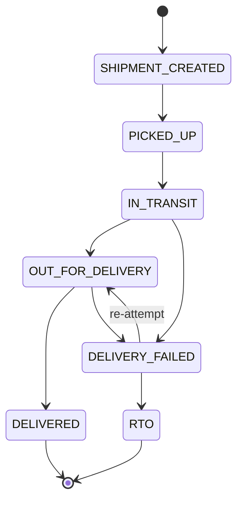

# Courier Normalization — Zippy Mock Logistics Platform

## Rate Response Field Mapping

### FastShip → Zippy Rate

| FastShip Field | Zippy Field | Transformation |
|----------------|-------------|----------------|
| (hardcoded) | `carrierCode` | `"FASTSHIP"` |
| (hardcoded) | `carrierName` | `"FastShip"` |
| `service.service_code` | `serviceCode` | Direct copy (e.g. `"FAST-AIR"`) |
| `service.service_name` | `serviceName` | Direct copy |
| `service.freight_charge` | `baseCharge` | Direct copy |
| `service.cod_charge` | `codCharge` | Direct copy |
| (none) | `additionalCharges` | `0.00` (FastShip has no additional charges) |
| `service.tax` | `tax` | Direct copy |
| `service.total_amount` | `totalCharge` | Direct copy |
| `service.estimated_days` | `estimatedMinDays` | Direct copy (single value) |
| `service.estimated_days` | `estimatedMaxDays` | Direct copy (same — no range given) |

**Notes:**
- FastShip returns **one** service option per request.
- If `success` is `false`, treat as courier unavailable.
- Weight conversion: Order stores grams → FastShip expects `weight_kg` → divide by 1000.

---

### QuickExpress → Zippy Rate

| QuickExpress Field | Zippy Field | Transformation |
|--------------------|-------------|----------------|
| (hardcoded) | `carrierCode` | `"QUICKEXPRESS"` |
| (hardcoded) | `carrierName` | `"QuickExpress"` |
| `product` | `serviceCode` | Direct copy (e.g. `"EXPRESS"`) |
| `"QuickExpress " + product` | `serviceName` | Concatenation (e.g. `"QuickExpress Express"`) |
| `charges.shipping` | `baseCharge` | Direct copy |
| `charges.cod` | `codCharge` | Direct copy |
| `charges.fuelSurcharge` | `additionalCharges` | Direct copy |
| `charges.gst` | `tax` | Direct copy |
| `payable` | `totalCharge` | Direct copy |
| `deliveryEstimate.minimumDays` | `estimatedMinDays` | Direct copy |
| `deliveryEstimate.maximumDays` | `estimatedMaxDays` | Direct copy |

**Notes:**
- QuickExpress returns **one** service option per request.
- `quoteId` (e.g. `"QE-Q-90001"`) must be stored — it's required for shipment creation.
  Stored in `raw_carrier_response` JSON on the ShippingQuote entity.
- If `status` is not `"AVAILABLE"`, treat as courier unavailable.
- Weight: QuickExpress expects `weightInGrams` — no conversion needed.

---

### ReliableCourier → Zippy Rate

| ReliableCourier Field | Zippy Field | Transformation |
|-----------------------|-------------|----------------|
| (hardcoded) | `carrierCode` | `"RELIABLE"` |
| (hardcoded) | `carrierName` | `"ReliableCourier"` |
| `data[].id` | `serviceCode` | Direct copy (e.g. `"RC-SURFACE"`) |
| `data[].name` | `serviceName` | Direct copy (e.g. `"Reliable Surface"`) |
| `data[].rate.base` | `baseCharge` | Direct copy |
| `data[].rate.cashCollectionFee` | `codCharge` | Direct copy |
| `data[].rate.handling` | `additionalCharges` | Direct copy |
| `data[].rate.taxAmount` | `tax` | Direct copy |
| `data[].rate.grandTotal` | `totalCharge` | Direct copy |
| `data[].eta` | `estimatedMinDays` | Parse from string: `"4-5 business days"` → `4` |
| `data[].eta` | `estimatedMaxDays` | Parse from string: `"4-5 business days"` → `5` |

**Notes:**
- ReliableCourier returns **multiple** service options (array in `data`). Each element produces
  one `NormalizedShippingOption`.
- ETA parsing: regex `(\d+)-(\d+)` extracts min/max days. If single number (e.g. `"3 days"`),
  use for both min and max.
- If `code` is not `200`, treat as courier unavailable.
- Weight: ReliableCourier rate API expects grams as query param — no conversion needed.
- Weight: ReliableCourier shipment API expects KG — divide by 1000 at adapter layer.

---

## Webhook Status Mapping

### Status Normalization Table

| Zippy Status | FastShip `event_code` | QuickExpress `event.type` | ReliableCourier `statusId` |
|---|---|---|---|
| `SHIPMENT_CREATED` | `BOOKED` | `SC` | `10` |
| `PICKED_UP` | `PICKED_UP` | `PU` | `20` |
| `IN_TRANSIT` | `IN_TRANSIT` | `IT` | `30` |
| `OUT_FOR_DELIVERY` | `OUT_FOR_DELIVERY` | `OFD` | `40` |
| `DELIVERED` | `DELIVERED` | `DLV` | `50` |
| `DELIVERY_FAILED` | `DELIVERY_FAILED` | `NDR` | `60` |
| `RTO` | `RETURNED` | `RTO` | `70` |

### Webhook Event Field Mapping

#### FastShip Webhook → ShipmentEvent

| FastShip Field | ShipmentEvent Field | Transformation |
|----------------|---------------------|----------------|
| `shipment_id` | (lookup key) | Find Shipment by `carrier_shipment_id` |
| `"{shipment_id}_{event_code}"` | `carrier_event_id` | Composite key for dedup |
| `event_code` | `carrier_status` | Direct copy |
| (mapped) | `normalized_status` | See table above |
| `event_description` | `description` | Direct copy |
| `location` | `location` | Direct copy |
| `event_time` | `event_time` | Parse ISO-8601 |
| (full JSON) | `raw_event_payload` | Serialize entire payload |

#### QuickExpress Webhook → ShipmentEvent

| QuickExpress Field | ShipmentEvent Field | Transformation |
|--------------------|---------------------|----------------|
| `awb` | (lookup key) | Find Shipment by `tracking_number` |
| `"{awb}_{event.type}"` | `carrier_event_id` | Composite key for dedup |
| `event.type` | `carrier_status` | Direct copy |
| (mapped) | `normalized_status` | See table above |
| `event.message` | `description` | Direct copy |
| `facility.city` | `location` | Direct copy |
| `event.occurredAt` | `event_time` | Parse ISO-8601 |
| (full JSON) | `raw_event_payload` | Serialize entire payload |

#### ReliableCourier Webhook → ShipmentEvent

| ReliableCourier Field | ShipmentEvent Field | Transformation |
|-----------------------|---------------------|----------------|
| `trackingCode` | (lookup key) | Find Shipment by `tracking_number` |
| `"{trackingCode}_{statusId}"` | `carrier_event_id` | Composite key for dedup |
| `statusId` (as string) | `carrier_status` | Convert int to string |
| (mapped) | `normalized_status` | See table above |
| `statusText` | `description` | Direct copy |
| `proofOfDelivery.deliveryLocation` | `location` | If present; otherwise `null` |
| `updatedOn` | `event_time` | Parse ISO-8601 |
| (full JSON) | `raw_event_payload` | Serialize entire payload |

---

## Status State Machine

### Valid Transitions



### Transition Rules

| From | Allowed Next States |
|------|---------------------|
| `SHIPMENT_CREATED` | `PICKED_UP` |
| `PICKED_UP` | `IN_TRANSIT` |
| `IN_TRANSIT` | `OUT_FOR_DELIVERY`, `DELIVERY_FAILED` |
| `OUT_FOR_DELIVERY` | `DELIVERED`, `DELIVERY_FAILED` |
| `DELIVERY_FAILED` | `OUT_FOR_DELIVERY` (re-attempt), `RTO` |
| `DELIVERED` | (none — terminal state) |
| `RTO` | (none — terminal state) |

### Handling Invalid Transitions

**Decision: Reject with HTTP 409 and log.**

Rationale:
- **Data integrity** — silently accepting invalid transitions (e.g. `DELIVERED` → `IN_TRANSIT`)
  would corrupt the shipment history and confuse merchants.
- **Auditability** — rejecting with a clear error message and logging the raw payload means we
  can investigate courier-side bugs without polluting our data.
- **Courier behavior** — if a courier sends an invalid transition, it's likely a bug on their
  end. Accepting it silently hides the problem.

Implementation:
```java
public void validateTransition(String currentStatus, String newStatus) {
    Set<String> allowedNext = VALID_TRANSITIONS.get(currentStatus);
    if (allowedNext == null || !allowedNext.contains(newStatus)) {
        log.warn("Invalid transition: {} → {} (rejected)", currentStatus, newStatus);
        throw new InvalidStatusTransitionException(currentStatus, newStatus);
    }
}
```

The webhook endpoint catches `InvalidStatusTransitionException` and still returns HTTP 200 to
the courier (to prevent retries), but logs the event at WARN level and stores the raw payload
in a dead-letter mechanism (a log file or a separate `rejected_events` table if needed).

**Correction to above:** On reflection, returning 200 even for rejected transitions is safer
for webhook reliability (couriers may retry on non-2xx). The event is logged but not persisted
as a status-history entry. The `raw_event_payload` is logged at WARN level for investigation.

---

## Unknown Status Codes

If a courier sends a status code not in the mapping table:

- **FastShip/QuickExpress**: Log at WARN, store the raw event with `normalized_status = "UNKNOWN"`,
  do not update `current_status` on the Shipment.
- **ReliableCourier**: Same handling — unknown `statusId` values are logged and stored but don't
  affect the shipment's current status.

This is forward-compatible: if a courier adds a new status, we capture the data without crashing.
