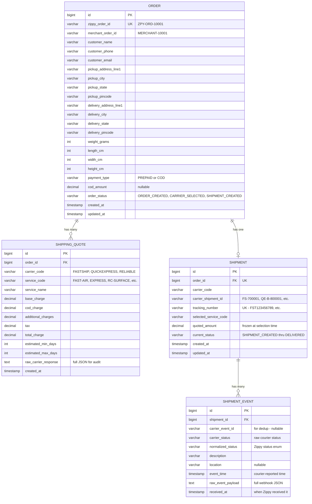

# Data Model — Zippy Mock Logistics Platform

## Entity-Relationship Diagram



---

## Extended Fields Beyond Minimum Data Model

The spec's minimum data model stores only `pickup_pincode` and `delivery_pincode`. We extend
with full address fields because:

1. The **order creation form** collects full addresses (addressLine1, city, state, pincode)
2. The **Order Details screen** should display customer and address info
3. Courier shipment-creation APIs need some address data (shipper/consignee names, postal codes)

Added columns on `ORDER`:
- `pickup_address_line1`, `pickup_city`, `pickup_state`
- `delivery_address_line1`, `delivery_city`, `delivery_state`

---

## Migration Strategy

**Tool: Flyway**

Flyway is chosen over Liquibase because:
- Simpler mental model (numbered SQL scripts, no XML/YAML DSL to learn)
- Native Spring Boot auto-configuration (`spring.flyway.enabled=true`)
- SQL scripts are transparent — easy to review, diff, and debug

### Migration File Convention

```
src/main/resources/db/migration/
├── V1__create_order_table.sql
├── V2__create_shipping_quote_table.sql
├── V3__create_shipment_table.sql
├── V4__create_shipment_event_table.sql
```

Naming: `V{version}__{description}.sql` (double underscore between version and description).

### V1 — Order Table

```sql
CREATE TABLE orders (
    id              BIGINT GENERATED ALWAYS AS IDENTITY PRIMARY KEY,
    zippy_order_id  VARCHAR(20)    NOT NULL UNIQUE,
    merchant_order_id VARCHAR(100) NOT NULL,
    customer_name   VARCHAR(200)   NOT NULL,
    customer_phone  VARCHAR(20)    NOT NULL,
    customer_email  VARCHAR(200),
    pickup_address_line1 VARCHAR(500),
    pickup_city     VARCHAR(100),
    pickup_state    VARCHAR(100),
    pickup_pincode  VARCHAR(10)    NOT NULL,
    delivery_address_line1 VARCHAR(500),
    delivery_city   VARCHAR(100),
    delivery_state  VARCHAR(100),
    delivery_pincode VARCHAR(10)   NOT NULL,
    weight_grams    INT            NOT NULL,
    length_cm       INT,
    width_cm        INT,
    height_cm       INT,
    payment_type    VARCHAR(10)    NOT NULL,
    cod_amount      DECIMAL(12, 2),
    order_status    VARCHAR(30)    NOT NULL DEFAULT 'ORDER_CREATED',
    created_at      TIMESTAMP      NOT NULL DEFAULT CURRENT_TIMESTAMP,
    updated_at      TIMESTAMP      NOT NULL DEFAULT CURRENT_TIMESTAMP
);
```

### V2 — Shipping Quote Table

```sql
CREATE TABLE shipping_quotes (
    id                  BIGINT GENERATED ALWAYS AS IDENTITY PRIMARY KEY,
    order_id            BIGINT         NOT NULL REFERENCES orders(id),
    carrier_code        VARCHAR(30)    NOT NULL,
    service_code        VARCHAR(30)    NOT NULL,
    service_name        VARCHAR(100)   NOT NULL,
    base_charge         DECIMAL(12, 2) NOT NULL,
    cod_charge          DECIMAL(12, 2) NOT NULL DEFAULT 0,
    additional_charges  DECIMAL(12, 2) NOT NULL DEFAULT 0,
    tax                 DECIMAL(12, 2) NOT NULL DEFAULT 0,
    total_charge        DECIMAL(12, 2) NOT NULL,
    estimated_min_days  INT            NOT NULL,
    estimated_max_days  INT            NOT NULL,
    raw_carrier_response TEXT,
    created_at          TIMESTAMP      NOT NULL DEFAULT CURRENT_TIMESTAMP
);

CREATE INDEX idx_shipping_quotes_order_id ON shipping_quotes(order_id);
```

### V3 — Shipment Table

```sql
CREATE TABLE shipments (
    id                   BIGINT GENERATED ALWAYS AS IDENTITY PRIMARY KEY,
    order_id             BIGINT         NOT NULL UNIQUE REFERENCES orders(id),
    carrier_code         VARCHAR(30)    NOT NULL,
    carrier_shipment_id  VARCHAR(50),
    tracking_number      VARCHAR(50)    UNIQUE,
    selected_service_code VARCHAR(30)   NOT NULL,
    quoted_amount        DECIMAL(12, 2) NOT NULL,
    current_status       VARCHAR(30)    NOT NULL DEFAULT 'SHIPMENT_CREATED',
    created_at           TIMESTAMP      NOT NULL DEFAULT CURRENT_TIMESTAMP,
    updated_at           TIMESTAMP      NOT NULL DEFAULT CURRENT_TIMESTAMP
);

CREATE INDEX idx_shipments_tracking_number ON shipments(tracking_number);
CREATE INDEX idx_shipments_carrier_shipment_id ON shipments(carrier_shipment_id);
```

### V4 — Shipment Event Table

```sql
CREATE TABLE shipment_events (
    id                 BIGINT GENERATED ALWAYS AS IDENTITY PRIMARY KEY,
    shipment_id        BIGINT       NOT NULL REFERENCES shipments(id),
    carrier_event_id   VARCHAR(100),
    carrier_status     VARCHAR(50)  NOT NULL,
    normalized_status  VARCHAR(30)  NOT NULL,
    description        VARCHAR(500),
    location           VARCHAR(200),
    event_time         TIMESTAMP    NOT NULL,
    raw_event_payload  TEXT,
    received_at        TIMESTAMP    NOT NULL DEFAULT CURRENT_TIMESTAMP
);

CREATE INDEX idx_shipment_events_shipment_id ON shipment_events(shipment_id);
CREATE UNIQUE INDEX idx_shipment_events_idempotency
    ON shipment_events(shipment_id, carrier_event_id)
    WHERE carrier_event_id IS NOT NULL;
```

---

## Indexing Notes

| Index | Purpose |
|-------|---------|
| `orders.zippy_order_id` UNIQUE | Fast lookup by Zippy order ID, enforces uniqueness |
| `shipping_quotes.order_id` | FK lookup — all quotes for an order |
| `shipments.order_id` UNIQUE | One shipment per order, FK lookup |
| `shipments.tracking_number` UNIQUE | Webhook lookup by tracking number |
| `shipments.carrier_shipment_id` | Webhook lookup by carrier shipment ID (FastShip uses this) |
| `shipment_events(shipment_id, carrier_event_id)` UNIQUE (partial) | **Webhook idempotency** — prevents duplicate events from the same carrier for the same shipment. Partial index excludes NULLs so manually-created events without carrier_event_id are unaffected. |
| `shipment_events.shipment_id` | Event history lookup for a shipment |

### Idempotency Key Strategy

The composite unique index on `(shipment_id, carrier_event_id)` is the primary deduplication
mechanism:

- **FastShip**: `carrier_event_id` = `"{shipment_id}_{event_code}"` (e.g. `"FS-700001_IN_TRANSIT"`)
- **QuickExpress**: `carrier_event_id` = `"{awb}_{event_type}"` (e.g. `"QE987654321_OFD"`)
- **ReliableCourier**: `carrier_event_id` = `"{trackingCode}_{statusId}"` (e.g. `"RC1122334455_50"`)

If a courier sends the same event twice, the DB constraint catches the duplicate and the
application handles the `DataIntegrityViolationException` gracefully (log and return 200 to
the courier — they don't need to retry).

---

## Database Configuration

### PostgreSQL (via Docker Compose)

```yaml
spring:
  datasource:
    url: jdbc:postgresql://localhost:5432/zippydb
    username: zippy
    password: zippy
    driver-class-name: org.postgresql.Driver
  jpa:
    database-platform: org.hibernate.dialect.PostgreSQLDialect
  flyway:
    locations: classpath:db/migration
```

For local development, PostgreSQL runs via Docker Compose (`docker compose up postgres`).
For tests, Spring Boot Test uses Testcontainers or the same Docker PostgreSQL instance.

